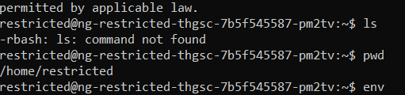
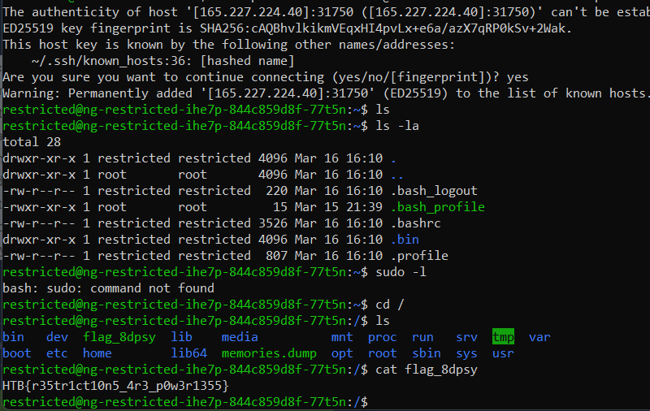

# Restricted
> You 're still trying to collect information for your research on the alien relic. Scientists contained the memories of ancient egyptian mummies into small chips, where they could store and replay them at will. Many of these mummies were part of the battle against the aliens and you suspect their memories may reveal hints to the location of the relic and the underground vessels. You managed to get your hands on one of these chips but after you connected to it, any attempt to access its internal data proved futile. The software containing all these memories seems to be running on a restricted environment which limits your access. Can you find a way to escape the restricted environment ?

## About the Challenge
We were given a source code (You can download the file [here](misc_restricted.zip)) that contains `sshd_config` and `bash_profile`

## How to Solve?
If we login normally using this command

```
ssh -p PORT restricted@IP
```

You still can get into the server, but there is some restriction (You can't use some commands, you can move into another directory, etc.)



And to bypass this, Im using this [website](https://www.hackingarticles.in/multiple-methods-to-bypass-restricted-shell/) as a reference. Here is the command

```
ssh -p PORT restricted@IP -t "bash --noprofile" 
```



```
HTB{r35tr1ct10n5_4r3_p0w3r1355}
```