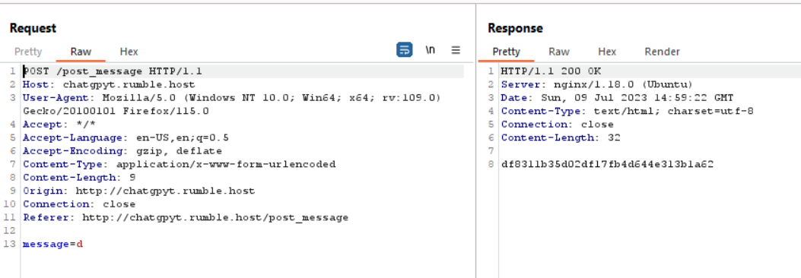
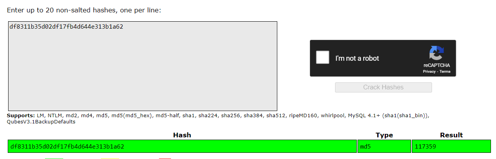

# ChapGPyT
> I've made ChatGPT implemented a challenge. I hope you can solve this verry hard challenge

## About the Challenge
We have been given a website to test and this website only have 2 endpoints. First is `/post_message` where we can input our message and then in the response we got some random string. Here is the HTTP request and response when I tried to send a random message using `/post_message` endpoint



And then the second endpoint is `/get_message/$id`. We need to input the output from the `/post_message` endpoint into the `$id`. So for example `/get/message/df8311b35d02df17fb4d644e313b1a62`


Our input will be reflected in the response

## How to Solve?
At first, i got stuck for so long because i already tried some web exploitation such as Arbitrary File Upload, SSTI, etc. And then I tried to search the random string in google and also tried to crack the random string, it turns out that is a number that has been hashed using `MD5`



Now, I tried to check another message with id `c4ca4238a0b923820dcc509a6f75849b`. That hash is equivalent to 1


```
CSR{GrindingChatGPTUntilItGivesYOuAChallangeLol}
```