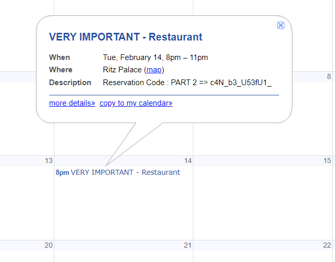

# David Cicode 2/2
> You found David's gmail account in the first part of the challenge, let's see what informations you can recover from it.

> Flag format : dvCTF{part1_part2_part3}

## About the Challenge
We need to do an OSINT on david's gmail account (dav1d.c1cod3@gmail.com). You need to get the email first from `David Cicode 1/2`


## How to Solve?
Usually to do OSINT on gmail, some people using tool called `GHunt`. But in this case i'll be using [Epieos](https://epieos.com/)


There are 2 services (Google Maps and Calendar). Check each service to get the flag

First I checked the Google Maps first and we will find the first part of the flag in the latest review


And then I checked on the google calendar service and we will find the second part of the flag (To get the flag check 14th February 2023)



And if you check another calendar, you will get link about Google Groups named `David Cicode`. There are 2 conversations and to get the flag, check the latest conversations


```
dvCTF{gHun7_c4N_b3_U53fU1_jYyMjk4NWRk}
```