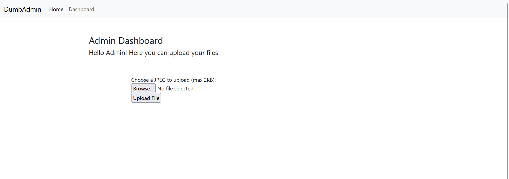
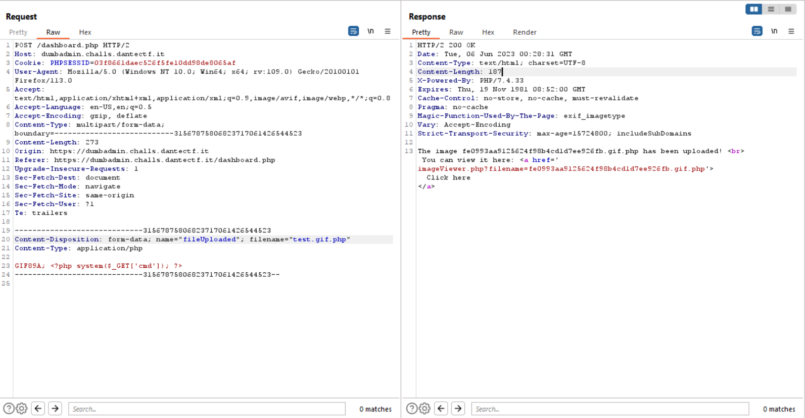
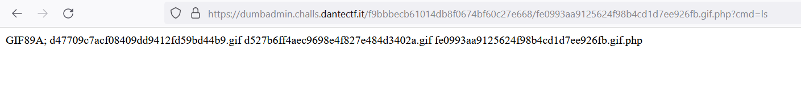
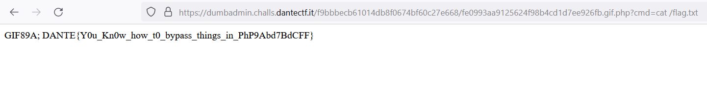

# Dumb Admin
> The Admin coded his dashboard by himself. He's sure to be a pro coder and he's so satisfied about it. Can you make him rethink that?

## About the Challenge
We were given a website that contain an admin panel, looks like we need to bypass the panel


## How to Solve?
First we need to bypass the admin panel by using SQL injection payload, here is the payload I used

```
Username: admin' or true-- -
Password: testtttttttttttttt
```

After that we will see find a file upload functionaility where we can upload an image there



We need to do `Remote Code Execution` by uploading a malicious PHP file. But there is some filter, the website will check the extension of the file, and the header of the file. But we can bypass it by using `.gif.php` extension and add `GIF89A` as a file header



Now we need to access `/imageViewer.php?filename=fe0993aa9125624f98b4cd1d7ee926fb.gif.php` to obtain the full path where we can access the file that we have uploaded before



The flag was located in the `/` directory



```
DANTE{Y0u_Kn0w_how_t0_bypass_things_in_PhP9Abd7BdCFF}
```