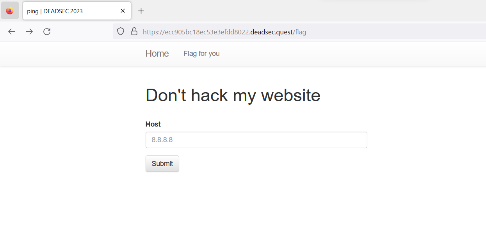

# Bing
> `-`

## About the Challenge
We have been given a website that contains a form and we can input a host there



And then I tried to input 127.0.0.1 and here was the output


## How to Solve?
We need to exploit the website using `Command Injection` vulnerability in order to read the flag. Here is the payload I used to read the flag

```
127.0.0.1;c\a\t${IFS}/f\lag.txt${IFS}|base64
```

Because some of the commands are blacklisted by the website (Like `cat` or `ls`), we can trick it with `/` character.  And because whitespace is also blacklisted by the website we can use `${IFS}`


```
dead{okokok!!!_th1s_flAg_f0R_Y0U}
```