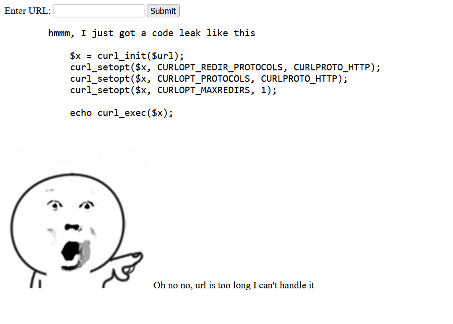
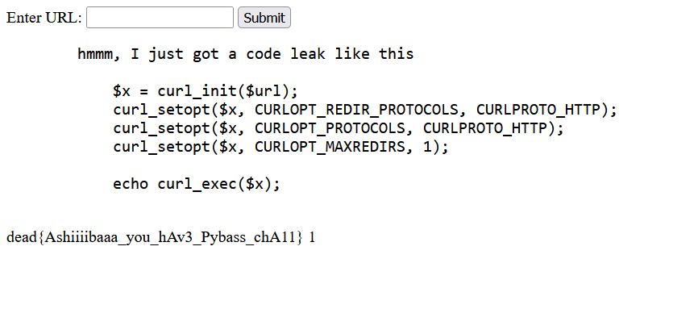

# FRSS
> `-`

## About the Challenge
We got a websites that can make requests to other websites and display the response


We need to access `/hehe.txt` by using that feature. However there is a limit of characters that we can input into that form



## How to Solve?
In order to read the flag, we need to access the website internally and access the `/hehe.txt` endpoint

At first, I inputted `127.0.0.1/hehe.txt` but the response is `Oh no no, url is too long I can't handle it`. And then I and found this [payload](https://github.com/swisskyrepo/PayloadsAllTheThings/blob/master/Server%20Side%20Request%20Forgery/README.md)


So, my final payload was:
```
0.0.0.0/hehe.txt
```



```
dead{Ashiiiibaaa_you_hAv3_Pybass_chA11}
```