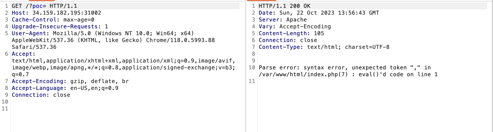
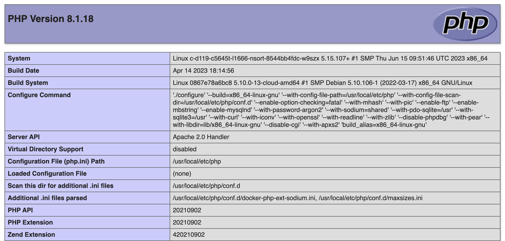
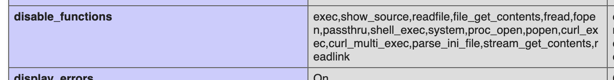
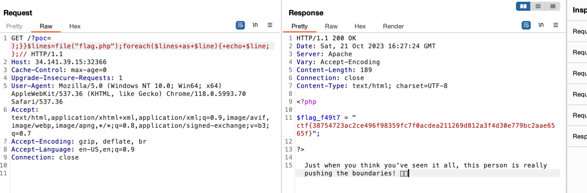

# nsort
> Can you escape the sandbox? Do you have all the needed info?

## About the Challenge
We were given a static website (There are no images, no forms, only texts)

```
🚩 Whoops! Looks like the proof-of-concept (poc) is missing! 🔍🧐 Don't worry, it's waiting for you in flag.php! Happy coding! 🤓💻 #MissingPOC #FlagHunt #PHPDev #missingpocinget
```

## How to Solve?
If we read the text again, it looks like we need to add `?poc` parameter in the URL and voilà! We got an error output



Hmm, our input goes into the `eval` function where we have to do Remote Code Execution (RCE). If we read the title again, it looks like the author using `sort` function inside the eval

After finding some reference about the RCE inside `sort` function, I got some useful information on Hacktricks (Thank you carlospolop!)

https://book.hacktricks.xyz/network-services-pentesting/pentesting-web/php-tricks-esp#rce-via-usort

And then we need to close some bracket and then running phpinfo function using this payload

```
);}}phpinfo();//
```



Yay we can execute PHP commands, but when I checked disable_functions information, almost all PHP functions which are to run OS commands cannot be used.



To obtain the flag I used a `file()` function to read `flag.php` file 



```
CTF{38754723ac2ce496f98359fc7f0acdea211269d812a3f4d30e779bc2aae6565f}
```