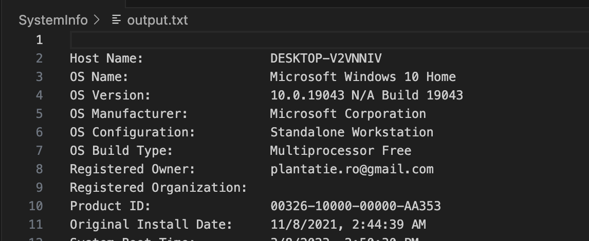
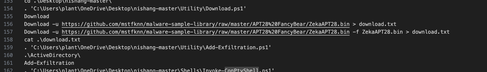
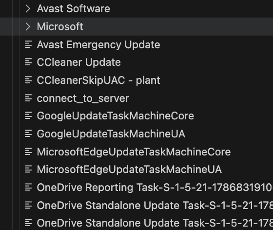

# who-done-it
> We might have an insider threat in our company. Help us to clarify this unconfortable situation.

## About the Challenge
We got a zip file called `who-was-it.zip` and the file contains some useful information about the victim pc such as PowerShell History / Device Information

## How to Solve?
There are 3 questions that we need to answer:

1. Identify the hostname of the compromised machine.

We can get the hostname information at `/SystemInfo/output.txt` file



2. Provide the name of the malware binary downloaded by the attacker on the compromised account.

If we check the PowerShell History command (Especially in `plant` user). In line 156-157, the attacker tried to download a file called `ZekaAPT28.bin`



3. Which is the suspicious scheduled task created by the attacker on the system?

We can get the suspicious scheduled task at /scheduled_task/Windows/System32/Tasks file



```
Q1: DESKTOP-V2VNNIV
Q2: ZekaAPT28.bin
Q3: connect_to_server
```