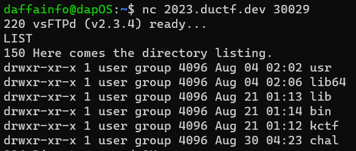

# SimpleFTPServer
> It always confused me why python had a simple HTTP server, but never a simple FTP server. So I made my own!

> I hope I didn't leave secrets open to the global internet...

## About the Challenge
We got a server to connect, where we can "execute" FTP command



## How to Solve?
At first I tried to see inside `chal` folder and we got 2 files, `flag.txt` and `pwn`. But when I want to get the `flag.txt` by running this command

```
RETR flag.txt
```

We got a fake flag


Now, let's see the `pwn` file. And wew, we got a python

```py
#!/usr/bin/env python3
# Adapted from: https://gist.github.com/ZoeS17/467387af22de19c028f0430dcfc5ada8#file-ftpserver-py-L83
# FTP spec comments borrowed from Wikipedia

import os,time,operator,sys
allow_delete = False
local_ip = '0.0.0.0'
local_port = 1337
currdir = os.path.abspath('.')
ENCODING = "utf-8"

f = open("/chal/flag.txt", "r")
FLAG = f.read()
f.close()

f = open("/chal/pwn", "r")
SOURCE_CODE = f.read()
f.close()

class FTPServerThread():
    def __init__(self):
        self.basewd=currdir
        self.cwd=self.basewd
        self.rest=False
        self.pasv_mode=False
        self.mode='A'

    def run(self):
        sys.stdout.buffer.write('220 vsFTPd (v2.3.4) ready...\r\n'.encode(ENCODING)) # Red Herring

        while True:
            sys.stdout.flush()
            recv=sys.stdin.buffer.readline()
            if not recv: break
            else:
                lst = recv.decode(ENCODING).strip().split(" ", 1)
                if len(lst) < 2:
                    cmd, args = lst[0], ""
                else:
                    cmd, args = lst
                try:
                    func=operator.attrgetter(cmd)(self)
                    msg = func(args)
                    sys.stdout.buffer.write(f'{msg}'.encode(ENCODING))
                except Exception as e:
                    sys.stdout.buffer.write(f'500 Sorry. {e}\r\n'.encode(ENCODING))

    def SYST(self,args):
        '''
        Return system type.
        '''
        return '215 UNIX Type: L8\r\n'

    def OPTS(self,args):
        '''
        RFC 2389        Select options for a feature (for example OPTS UTF8 ON).
        '''
        if args.upper()=='UTF8 ON':
            return '200 OK.\r\n'
        else:
            return '451 Sorry.\r\n'

    def USER(self,args):
        '''
        Authentication username.
        '''
        return '331 OK.\r\n'

    def PASS(self,args):
        '''
        Authentication password.
        '''
        # return '230 OK.\r\n'
        return '530 Incorrect.\r\n' # Red Herring

    def QUIT(self,args):
        '''
        Disconnect.
        '''
        sys.stdout.buffer.write('221 Goodbye.\r\n'.encode(ENCODING))
        exit()

    def NOOP(self,args):
        '''
        No operation (dummy packet; used mostly on keepalives).
        '''
        return '200 OK.\r\n'

    def TYPE(self,args):
        '''
        Sets the transfer mode
        '''
        if args == "A":
            self.mode=args
            return '200 ASCII mode.\r\n'
        if args == "I":
            self.mode=args
            return '200 Binary mode.\r\n'
        return '504 Command not implemented for that parameter.\r\n'

    def CDUP(self,args):
        '''
        Change to Parent Directory.
        '''
        if not os.path.samefile(self.cwd,self.basewd):
            #learn from stackoverflow
            self.cwd=os.path.abspath(os.path.join(self.cwd,'..'))
        return '200 OK.\r\n'

    def PWD(self,args):
        '''
        Print working directory. Returns the current directory of the host.
        '''
        cwd=os.path.relpath(self.cwd,self.basewd)
        if cwd=='.':
            cwd='/'
        else:
            cwd='/'+cwd
        return '257 \"%s\"\r\n' % cwd

    def CWD(self,args):
        '''
        RFC 697         Change working directory.
        '''
        chwd=args
        if chwd=='/':
            self.cwd=self.basewd
        elif chwd[0]=='/':
            self.cwd=os.path.join(self.basewd,chwd[1:])
        else:
            self.cwd=os.path.join(self.cwd,chwd)
        return '250 OK.\r\n'

    def PORT(self,args):
        '''
        Specifies an address and port to which the server should connect.
        '''
        return '501 Syntax error in parameters or argument.\r\n'

    def PASV(self,args):
        '''
        Enter passive mode.
        '''
        return '227 Entering Passive Mode (%s,%u,%u).\r\n' % ("ip_here", "port_here", "port_here") # Hint that this isn't a real server

    def LIST(self,args): # Red Herring, you see the flag.txt but get it
        sys.stdout.buffer.write(b'150 Here comes the directory listing.\r\n')
        for t in os.listdir(self.cwd):
            k=self.toListItem(os.path.join(self.cwd,t))
            sys.stdout.buffer.write((k+'\r\n').encode(ENCODING))
        return '226 Directory send OK.\r\n'

    def toListItem(self,fn):
        st=os.stat(fn)
        fullmode='rwxrwxrwx'
        mode=''
        for i in range(9):
            mode+=((st.st_mode>>(8-i))&1) and fullmode[i] or '-'
        d=(os.path.isdir(fn)) and 'd' or '-'
        ftime=time.strftime(' %b %d %H:%M ', time.gmtime(st.st_mtime))
        return d+mode+' 1 user group '+str(st.st_size)+ftime+os.path.basename(fn)

    def MKD(self,args):
        dn=os.path.join(self.cwd,args)
        os.mkdir(dn)
        return '257 Directory created.\r\n'

    def RMD(self,args):
        dn=os.path.join(self.cwd,args)
        if allow_delete:
            # os.rmdir(dn) # No mutations for you
            return '250 Directory deleted.\r\n'
        else:
            return '450 Not allowed.\r\n'

    def DELE(self,args):
        fn=os.path.join(self.cwd,args)
        if allow_delete:
            # os.remove(fn) # No mutations for you
            return '250 File deleted.\r\n'
        else:
            return '450 Not allowed.\r\n'

    def RNFR(self,args):
        self.rnfn=os.path.join(self.cwd,args)
        return '350 Ready.\r\n'

    def RNTO(self,args):
        fn=os.path.join(self.cwd,args)
        # os.rename(self.rnfn,fn)
        return '250 File renamed.\r\n'

    def REST(self,args):
        self.pos=int(args)
        self.rest=True
        return '250 File position reseted.\r\n'

    def RETR(self,args):
        fn=os.path.join(self.cwd,args)
        if self.mode=='I':
            fi=open(fn,'rb')
        else:
            fi=open(fn,'r')
        sys.stdout.buffer.write('150 Opening data connection.\r\n'.encode(ENCODING))
        if self.rest:
            fi.seek(self.pos)
            self.rest=False

        # Deny the flag, but make it clear they are on the correct track.
        if "flag.txt" in args:
            sys.stdout.write('DUCTF{- Actually no, I don\'t feel like giving that up yet. ;)\r\n')

        # "Leak" source code by allowing download of it.
        if "pwn" in args:
            sys.stdout.write(f'{SOURCE_CODE}\r\n')

        # data= fi.read(1024)
        # self.start_datasock()
        # while data:
        #     self.datasock.send(data)
        #     data=fi.read(1024)
        # fi.close()
        # self.stop_datasock()
        return '226 Transfer complete.\r\n'

    def STOR(self,args):
        fn=os.path.join(self.cwd,args)
        if self.mode=='I':
            fo=open(fn,'wb')
        else:
            fo=open(fn,'w')
        sys.stdout.buffer.write('150 Opening data connection.\r\n'.encode(ENCODING))
        # self.start_datasock()
        # while True:
        #     data=self.datasock.recv(1024)
        #     if not data: break
        #     fo.write(data)
        # fo.close()
        # self.stop_datasock()
        return '226 Transfer complete.\r\n'

FTPServerThread().run()
```

We receive a Python file that, when used, functions similarly to running an FTP server. Let's analyze the code

```py
f = open("/chal/flag.txt", "r")
FLAG = f.read()
f.close()
```

Hmmm, the content of the flag was stored in the `FLAG` varible, let's check another part of code

```py
def run(self):
    sys.stdout.buffer.write('220 vsFTPd (v2.3.4) ready...\r\n'.encode(ENCODING)) # Red Herring

    while True:
        sys.stdout.flush()
        recv=sys.stdin.buffer.readline()
        if not recv: break
        else:
            lst = recv.decode(ENCODING).strip().split(" ", 1)
            if len(lst) < 2:
                cmd, args = lst[0], ""
            else:
                cmd, args = lst
            try:
                func=operator.attrgetter(cmd)(self)
                msg = func(args)
                sys.stdout.buffer.write(f'{msg}'.encode(ENCODING))
            except Exception as e:
                sys.stdout.buffer.write(f'500 Sorry. {e}\r\n'.encode(ENCODING))
```

Hmmm this lines of code was interesting.

```py
func=operator.attrgetter(cmd)(self)
msg = func(args)
```

For example when we input something like this

```
RETR pwn
```

It will find a method / function named `RETR` and it will assigned to `func`. `func(args)` is then called with the `args` variable as its argument.

And then I got the idea to print all the global variable by calling `__getattribute__` method and then print the `__globals__` value like this

```
LIST.__getattribute__ __globals__
```


```
DUCTF{15_this_4_j41lbr34k?}
```