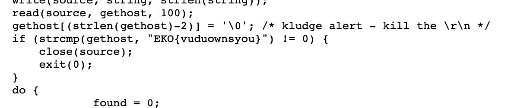

# Proxy
> Our dear friends from Ezkracho Team recommend us a nice utility to be used as a proxy, however, this one was protected with a singular password, may you find it?

## About the Challenge
We need to find tool first in the gopher protocol, and then doing a source code review

## How to Solve?
The tools referred to are the source code in a directory named `TOOLS`, and the file is named `bnc.c`. You can find the flag by using `search` feature and then find the format flag which is `EKO`



```
EKO{vuduownsyou}
```