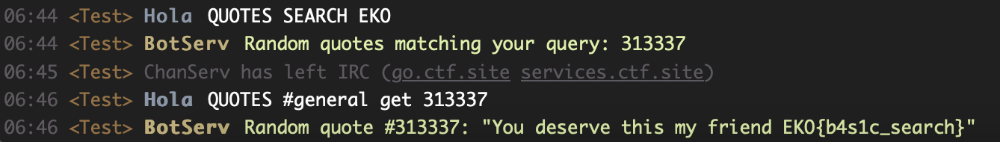

# Quotes
> No one will ever think about haxor quotes with flags inside.

## About the Challenge
There is a bot called `BotServ` which has many functions, such as being able to search for quotes, being able to display quotes, etc.


## How to Solve?
First, we need to search `EKO` in the quotes list using this command

```
/msg BotServ QUOTES SEARCH EKO
```

The result:
```
06:44 <Test> Hola QUOTES SEARCH EKO
06:44 <Test> BotServ Random quotes matching your query: 313337
```

Interesting, now we need to print the flag using the ID we just obtained using this command

```
/msg BotServ QUOTES #general get 313337
```



```
EKO{b4s1c_search}
```