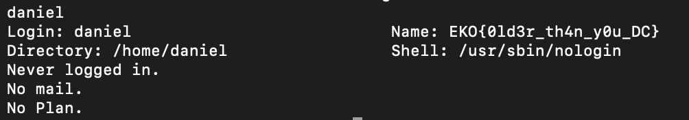

# Who
> My friend Daniel has a secret between his fingers!

## About the Challenge
The website using `finger` protocol to store the flag. We need to check user named `daniel` to obtain the flag

## How to Solve?
Just connect to the server and then type `danie` to get more information about that user

```bash
echo "daniel" | nc go.ctf.site 10079
```



```
EKO{0ld3r_th4n_y0u_DC}
```