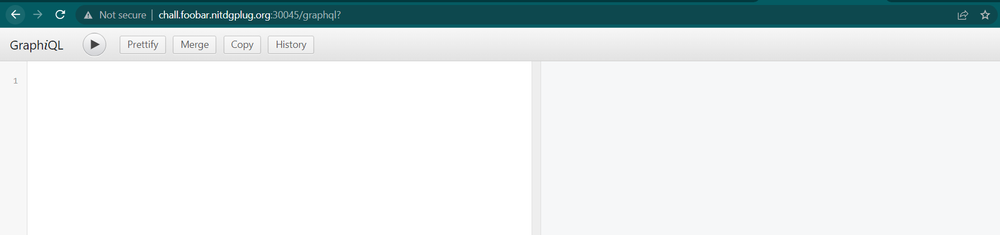
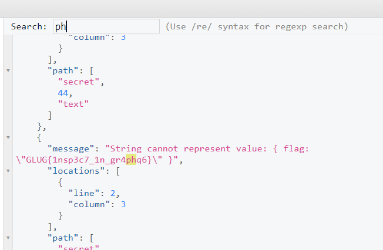

# inspect
> Don't think too much. Just push to production http://chall.foobar.nitdgplug.org:30045/

> Rest API was boring so I used modern technology.

## About the Challenge
We have been given a website and we need to get the flag from that website


## How to Solve?
After getting stuck for a while because I tried a lot of endpoint like `robots.txt` / `.git` / etc. But the website always return `404 Not Found`. And then I decided to doing some research about REST API and the alternative. Luckily I found `graphql` keyword and tried to access graphql endpoint.



And when I tried to input `{` in the form, I found a field named `secret` and I tried to execute GraphQL using this query


As you can see the result of the query is 75 different flags, but it's impossible to test the flag one by one. And im thinking, `Usually the flag is relatable with the chall, for example this chall is about graphql so the flag usually related to graphql`

I tried to search using `ph` (I took the 2 lettter from `graphql` keyword). And luckily I got the flag



```
GLUG{1nsp3c7_1n_gr4phq6}
```