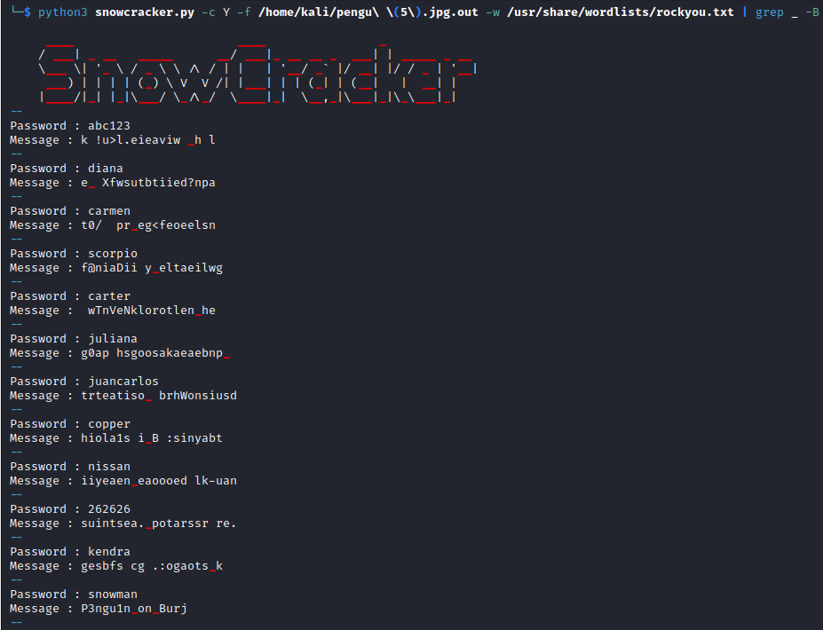

# Arctic Penguin
> I love penguins. They are so cute. One of my favourite penguin is missing. He was last seen under snow in north pole near arctic circle. There are news that he has been kidnapped by someone. Can you find him. Wait i've a picture, here you go. Please find him asap !

> PS. He likes buildings. A MAN trapped him in a building of SNOW.

## About the Challenge
We have been given a file (You can download the file [here](pengu.jpg)) and we need to find the flag using that picture

## How to Solve?
To solve this, Im using `stegseek` first to extract hidden data from files by performing bruteforce attack. Here is the command to bruteforce the image using `rockyou.txt` wordlist

```shell
stegseek Missing.jpg /usr/share/wordlists/rockyou.txt
```


We have a `txt` file now, but it contains only tabs and spaces. Afterwards, if we check the metadata of the picture


After searching about `Snow steganography`. Now im using stegsnow to get the flag, but we don't know the flag right? I came across this [tool](https://github.com/0xHasanM/SnowCracker) to brute stegsnow password. Here is the command that I used to crack the password

```shell
python3 snowcracker.py -c Y -f /home/kali/pengu\ \(5\).jpg.out -w /usr/share/wordlists/rockyou.txt | grep _ -B 1
```

So I performed brute-force attack using `rockyou.txt` wordlist and then grep the string that contain character `_`



```
GREP{snowman,P3ngu1n_on_Burj}
```