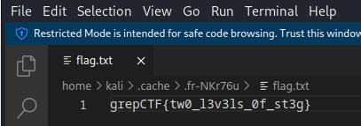

# Royal Steg
> Then Jesus turned, and seeing them following, said to them, 'what do you SEEK?

> - JOHN 1:38

## About the Challenge
We have been given a file (You can download the file [here](steg.jpg)) and we need to find the flag using that picture

## How to Solve?
To solve this, Im using `stegseek` first to extract hidden data from files by performing bruteforce attack. Here is the command to bruteforce the image using `rockyou.txt` wordlist

```shell
stegseek steg.jpg /usr/share/wordlists/rockyou.txt
```


We got password-protected zip file. Now we need to crack the zip password to obtain the flag by using `JohnTheRipper`. Here is the command that I used

```shell
zip2john steg.jpg.out > hash_steg.txt
john -w=/usr/share/wordlists/rockyou.txt hash_steg.txt
john --show hash_steg.txt
```

The `zip2john` tool is used to extract the password hash from a password-protected ZIP file and then next step is  crack the password hash contained in the `hash_steg.txt` file using `rockyou.txt` wordlist


Open the password-protected zip file using `jesuslove` as the password and you will obtain the flag



```
grepCTF{tw0_l3v3ls_0f_st3g}
```