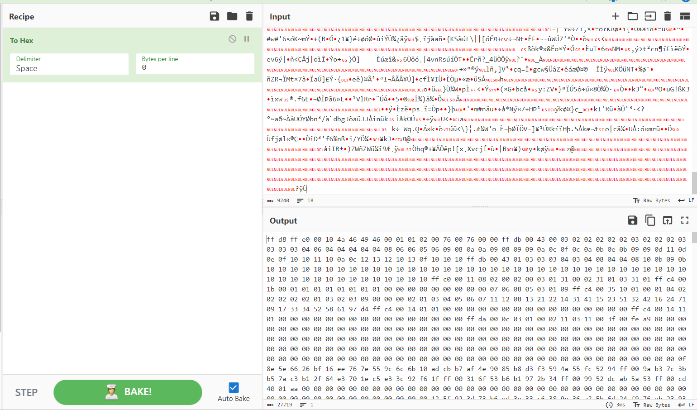

# Papapapa
> Is this image really just white?

## About the Challenge
We have been given an image (Blank image), and we need to find the flag inside the image (You can download the file [here](d2e5b38d584108c2b63150e7a073b8c104972ee59b83f5ee44d9ef6ae0118b4ad57e64cb328d7e8b839989ae741f793ded5fef7f51f7ecbbaaeaa716312f18c9.zip))

## How to Solve?
At first, I tried everything I knew to perform forensic analysis on a jpg file. I used various techniques such as employing steghide, altering the contrast, using binwalk, and more. However, I didn't find any significant results. During my search, I came across a [blog](https://cyberhacktics.com/hiding-information-by-changing-an-images-height/) titled "Hiding Information by Changing an Image's Height", which discusses a method of concealing information within an image by modifying its height and width.

First, im using [CyberChef](https://gchq.github.io/CyberChef/) and then input the image there



Grab the hexadecimal, and then use it as an input. Find `ff c0 00 11 08 ?? ?? ?? ??` value


The first `02 00` is the image height and `02 00` is the image width. Change the image width from `02 00` to `02 10` to read the flag


```
CTF{rearview-monorail-mullets-backroom-stopped}
```