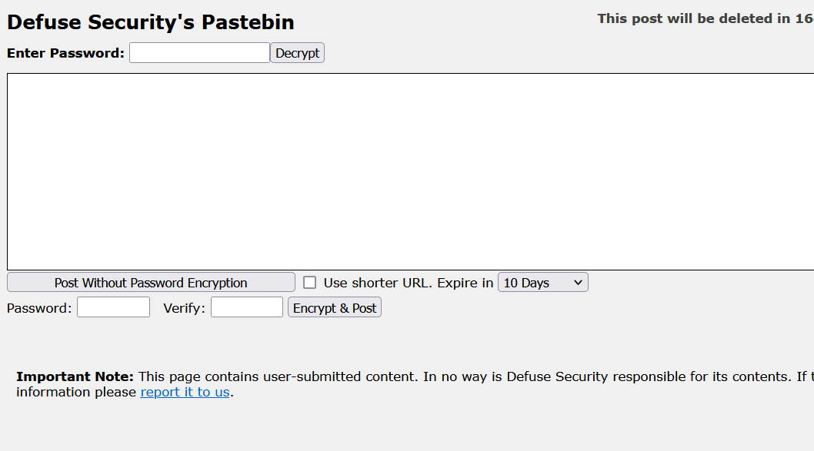
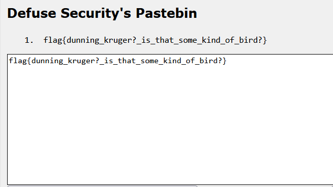

# vulpes-vulpes
> The red fox (Vulpes vulpes) is the largest of the true foxes and one of the most widely distributed members of the order Carnivora, being present across the entire Northern Hemisphere including most of North America, Europe and Asia, plus parts of North Africa. It is listed as least concern by the IUCN. Its range has increased alongside human expansion, having been introduced to Australia, where it is considered harmful to native mammals and bird populations. Due to its presence in Australia, it is included on the list of the "world's 100 worst invasive species".

## About the Challenge
We have been given a `zip` file that contain about firefox data such as history browser, add-on mozilla, etc. (You can download the file [here](vulpes-vuples.zip))

## How to Solve?
We need to import the file first into

```
C:\Users\USERS\AppData\Roaming\Mozilla\Firefox\Profiles
```

And then you will see that there is some history in May, and there is also a Mozilla add-on called `Tampermonkey`


You will notice there is a website called `defuse.ca`

```
https://defuse.ca/b/tpYyyE0Qgg04KNcjXTJBZc
```



Enable the addon and then press `Fill Password` button


Then you need to press `Decrypt` button on the website to obtain the flag



```
flag{dunning_kruger?_is_that_some_kind_of_bird?}
```