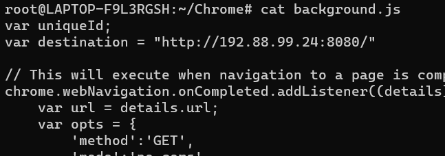

# Chrome-Plated Nonsense - 1
> Jubilife’s security operations center (SOC) team is looking into anomalous traffic from an employee’s Windows machine. When asked if they had recently seen anything odd or made any changes to their machine, the employee admitted to installing two new Chrome extensions.

> Jubilife would like you to review these Chrome extensions and determine whether they are causing the anomalous traffic and what, if any, malicious behavior they perform.

> The first extension is named Chrome-Speedboost (see attached crx file). The employee installed this extension to speed up their web browsing, but based on traffic the Jubilife SOC team has seen, they believe this extension is exfiltrating information.

> What are the IP address and port of the server the malicious extension is sending the exfiltrated data to?

> Flag format: IP address and port. Example: if the IP is 8.8.8.8 and the port is 53, the flag would be 8.8.8.8:53

## About the Challenge
We have been given a `crx` file (You can download the extension [here](chrome-speedboost.crx)) and we need to find the IP address and port of the server

## How to Solve?
We need to unzip the chrome extension first and as you can see there is a file called `background.js`


If we open the file we will get the ip and the port of the server



```
192.88.99.24:8080
```