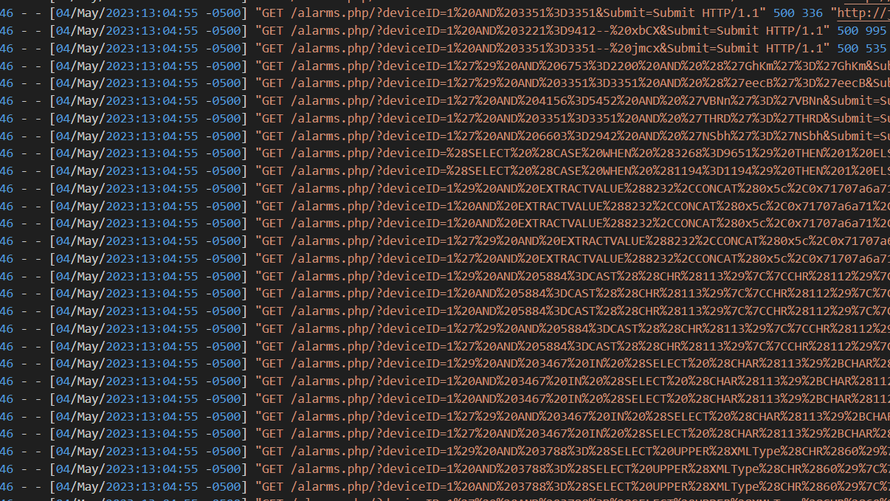
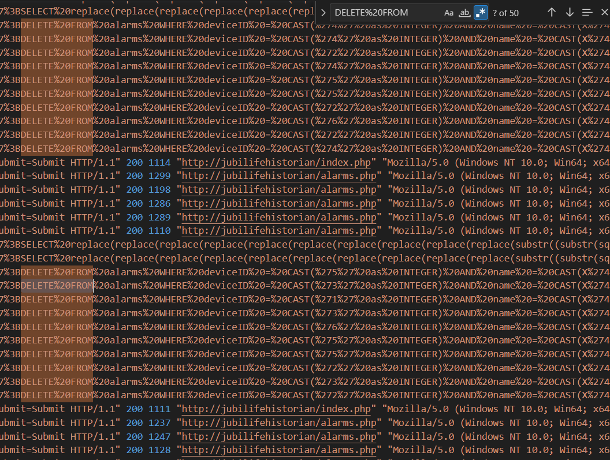

# The Historian Channel - 3
> The downloaded configuration file contained database schemas as well as information regarding the various alarms in Jubilife’s ICS network. It also contained hardcoded passwords, which could explain how the unauthorized user was eventually able to login successfully.

> There is no evidence that this configuration file has been changed in any way, which means the user must have found a different way to modify the alarm logging. However, the configuration file was probably used as part of their information gathering process.

> Looking deeper into the suspicious user’s activities, what are the names of the two alarms they deleted from the database?

> Flag format: alarm names in ASCII, comma separated (order does not matter). Example: if alarms with names ABCD and EFGH were deleted from database, accepted flags would be ABCD,EFGH or EFGH,ABCD.

## About the Challenge
We have been given a log file to analyze (You can download the file [here](access.log)). And we need to find the names of the 2 alarams that the users deleted from the database

## How to Solve?
As you can see in the log file, there are a lot of requests that contains SQL query



To obtain the flag, we need to find `DELETE` query. And I found there are 50 requests that contains `DELETE FROM` keywords but some of them returned `500` status code.



I found there are 2 requests that returned `200 OK` status code

```
';DELETE FROM alarms WHERE deviceID = CAST('5' as INTEGER) AND name = CAST(X'42313237' as TEXT);--
';DELETE FROM alarms WHERE deviceID = CAST('5' as INTEGER) AND name = CAST(X'43393639' as TEXT);--
```

Decode the hex to obtain the flag and seperate the name of the alarm using comma

```
B127,C969
```