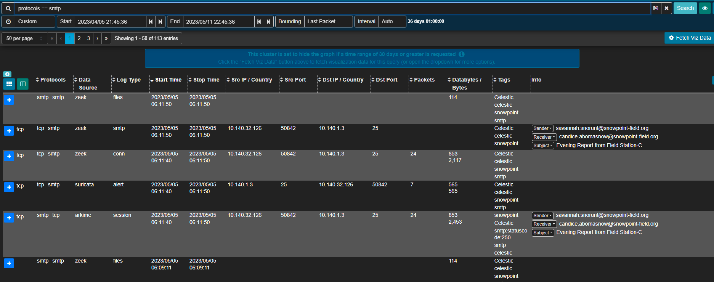
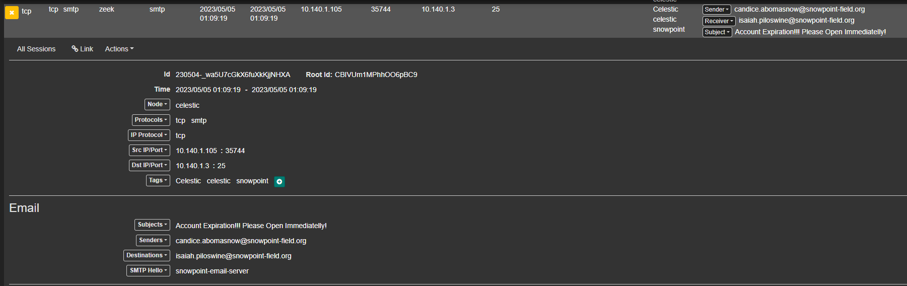

# The Phish Tank - 1
> Snowpoint has an internal mail server, which is used by field engineers on computers that do not have access to the Internet. Some of these engineers have reported emails that look suspiciously like phishing attempts. The internal mail server is very basic, and because it is located on an internal network, the Snowpoint staff did not spend much time configuring security or encryption. Consequently, all emails are sent over unencrypted SMTP.

> Network traffic from these emails is ingested into Malcolm. Since this network is not connected to the Internet, Snowpoint’s security team would like you to look at these emails and, if they do prove to be phishing emails, determine how they were sent from an internal network. The first step is identifying the source of the suspicious emails.

> What is the IP address of the computer that sent the phishy emails?

> Flag format: IP Address. Example: 192.168.1.20

## About the Challenge
We need to find the IP address of the computer that sent the phishy emails

## How to Solve?
In this case im using `Arkime` dashboard instead of `Malcolm` dashboard.First, im using this query in the search filter to find any logs that related to `SMTP` protocol

```
protocols == smtp
```



There are 113 entries. If we check the entries one by one, I found an interesting email


So we need to find an email about account expiration and I found an email from `10.140.1.105` about account expiration, a PDF report, and a DOCM file that might be malware.




```
10.140.1.105
```