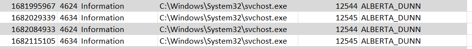

# Windows Pane - 1
> Jubilife's information technology (IT) team has seen unusual login event activity and would like your help identifying any suspicious activity in the attached logs.

> Jubilife has a strict company policy that each employee is assigned a single device and unique user account, and is only permitted to access the network from their device.

> This policy is in place to help IT by limiting each user to only be logged into one device at any given time; therefore, no user can be logged in twice at the same time.

> What is the username of the account that is noncompliant with this company policy?

> Flag format: username of the noncompliant account. If the username is MARK_ZUCKER, the flag would be MARK_ZUCKER

## About the Challenge
We have been given a CSV file (You can download the file [here](LogonEvents.csv)) that contains windows event logs. We need to find the username of the account that is noncompliant with the company policy


## How to Solve?
If we check the company policy, there are some rules:
* Each employee is assigned a single device and unique user account
* Only permitted to access the network from their device.
* No user can be loged in twice at the same time

So, to find the suspicious user we need to find the user that breaks the company policy.

The idea is to find the users who logged in at the same time. By analyzing the Windows event logs, you can observe that the ID for a user logging into the server is `4634` whereas the ID for a user logging out from the server is `4624`. This is a normal user log:



Normally you will see the code is `4624` that means the user logged in, and then logged out, and so on.

I attempted to sort the usernames first. Upon reviewing the information for `ABIGAIL_FORBES`, I noticed that the code `4624` appeared twice, and the timestamps were very close to each other. So, I suspect that this user may be suspicious.

```
ABIGAIL_FORBES
```