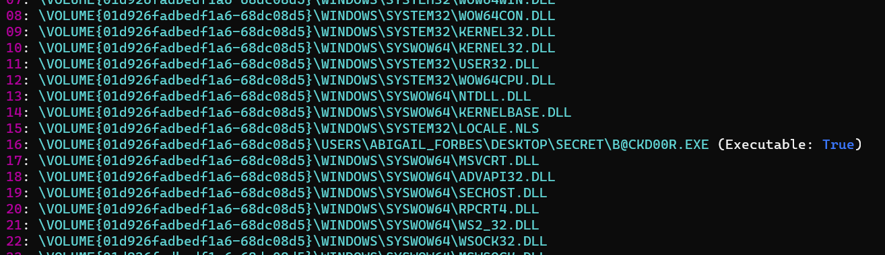

# Windows Pane - 2
> Due to this logon behavior, Jubilife would like to perform additional forensics on Abigail's machine. The attached prefetch data was extracted from their machine and Jubilife would like your assistance to find any evidence of a malicious executable.

> What is the full directory path of the malicious backdoor executable?

> Flag format: full directory path of malicious executable. Example: C:\Users\User\Desktop\Path.exe

> Note: A Windows machine or Windows VM is recommended for solving this challenge.

## About the Challenge
We have been given a zip file that contains prefetch files (You can download the file [here](Prefetch.zip)). We need to find the full directory path of malicious executable 

## How to Solve?
Unzip the zip file first, and you will see a lot of prefetch files. But there is 1 file called `B@CKD00R.EXE-7CB4E6DE.pf` that has caught my attention

So to parse the `pf` file, you can use [PECmd](https://github.com/EricZimmerman/PECmd) tools or `Prefetch Explorer Command Line`. And here is the command that I used to parse the `B@CKD00R.EXE-7CB4E6DE.pf`

```
.\PECmd.exe -f '\Prefetch\Prefetch\B@CKD00R.EXE-7CB4E6DE.pf'
```



As you can see in the result of the tool, there was location of malicious executable

```
\VOLUME{01d926fadbedf1a6-68dc08d5}\USERS\ABIGAIL_FORBES\DESKTOP\SECRET\B@CKD00R.EXE
```