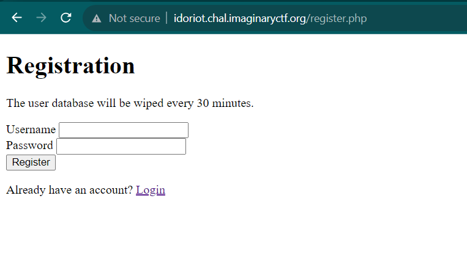

# Idoriot
> Some idiot made this web site that you can log in to. The idiot even made it in php. I dunno.

## About the Challenge
We have been given a website that has 2 functionality, first we can register as a user in this website



And then, after registered an account, you can also login into the website


And then after login, there is a source code that you can see written in PHP


```php
<?php

session_start();

// Check if user is logged in
if (!isset($_SESSION['user_id'])) {
    header("Location: login.php");
    exit();
}

// Check if session is expired
if (time() > $_SESSION['expires']) {
    header("Location: logout.php");
    exit();
}

// Display user ID on landing page
echo "Welcome, User ID: " . urlencode($_SESSION['user_id']);

// Get the user for admin
$db = new PDO('sqlite:memory:');
$admin = $db->query('SELECT * FROM users WHERE user_id = 0 LIMIT 1')->fetch();

// Check if the user is admin
if ($admin['user_id'] === $_SESSION['user_id']) {
    // Read the flag from flag.txt
    $flag = file_get_contents('flag.txt');
    echo "<h1>Flag</h1>";
    echo "<p>$flag</p>";
} else {
    // Display the source code for this file
    echo "<h1>Source Code</h1>";
    highlight_file(__FILE__);
}

?>
```

To read the flag, we need to login as an admin where the `user_id` is `0`

## How to Solve?
I believe, I solved this chall using unintended way, as you can see in this code

```php
if ($admin['user_id'] === $_SESSION['user_id']) {
    // Read the flag from flag.txt
    $flag = file_get_contents('flag.txt');
    echo "<h1>Flag</h1>";
    echo "<p>$flag</p>";
}
```

The location of the flag is `flag.txt` not `/flag.txt`. So, you can read the flag directly by accessing http://idoriot.chal.imaginaryctf.org/flag.txt


```
ictf{1ns3cure_direct_object_reference_from_hidden_post_param_i_guess}
```