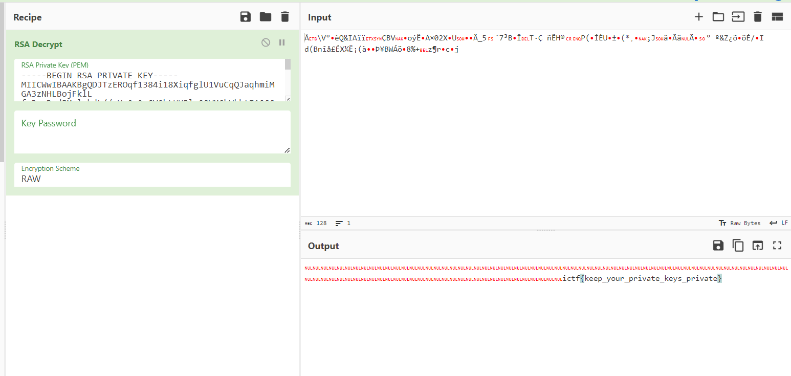

# rsa
> I think I did my RSA right...

## About the Challenge
We got 3 files, `flag.enc`, `public.pem` and `private.pem`. And we need to decrypt the `flag.enc`

## How to Solve?
Well, because we've got the private key, we can decrypt file directly. In this case im using `CyberChef` to decrypt the flag



```
ictf{keep_your_private_keys_private}
```