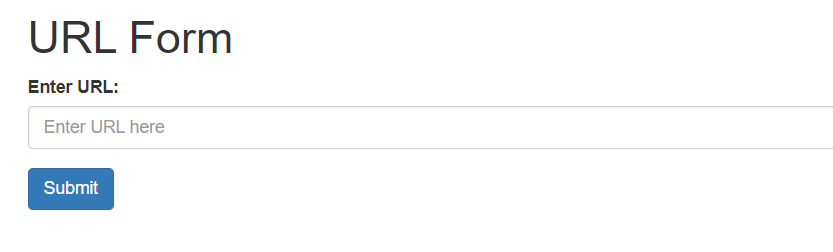

# get flag 1
> `-`

## About the Challenge
We are given a website and we need to get the flag on port `9001`



## How to Solve?
I solve this chall by using SSRF (Server-Side Request Forgery) vulnerability to retrieve the flag on port 9001. But there is some filter, for example i can't use `http://127.0.0.1` payload. To bypass the filter, im using `http://0.0.0.0` payload and then i can get the flag by accessing
```
http://45.79.210.216:5000/getUrl?url=http://127.0.0.1:9001/flag.txt
```

And then you will retrieve the flag

```
ictf{l0c4l_byp4$$_323theu0a9}
```