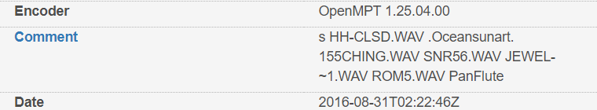

# Name that song
> Here's an IT song for you. The original title has been redacted. What was the original name of the song? Wrap the title in flag format, all lowercase. Any special characters and spaces should be replaced with an underscore. If the song's name was "Never Gonna Give You Up", type irisctf{never_gonna_give_you_up}.

## About the Challenge
The purpose of this problem is how to get the title of the song that has been given. Sounds easy right? (You can get the song [**here**](/IrisCTF-2023/Name%20that%20song/song_1.it))

## How to Solve?
First i check the metadata of the file, im using https://www.metadata2go.com/ and I got interesting metadata named `Comment`.



I am trying to find the song using the comment metadata on google


The result is `https://modarchive.org/index.php?request=view_by_moduleid&query=179035` Is moon cities the answer? No, because the song has a different note even though the beat is the same. And i check the artist and found the song.
```
irisctf{moon_gun}
```