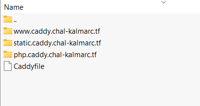

# Ez ⛳
> Heard 'bout that new 🏌️-webserver? Apparently HTTPS just works(!), but seems like someone managed to screw up the setup, woops. The flag.txt is deleted until I figure out that HTTPS and PHP stuff #hacker-proof

## About the Challenge
We are given a website and the source code (You can get the source code [here])

## How to Solve?
You will notice there are 3 subdomains when you open the zip file



And inside the `php.caddy.chal-kalmarc.tf` folder there is a fake flag. So at first I thought we need request to `//php.caddy.chal-kalmarc.tf/flag.txt` to get the flag, but inside `docker-compose` file the author of the chall decided to remove the flag but there is a `backups` folder

```bash
apk add --update openssl nss-tools && rm -rf /var/cache/apk/ && openssl req -x509 -batch -newkey rsa:2048 -nodes -keyout /etc/ssl/private/caddy.key -days 365 -out /etc/ssl/certs/caddy.pem -subj '/C=DK/O=Kalmarunionen/CN=*.caddy.chal-kalmarc.tf' && mkdir -p backups/ && cp -r *.caddy.chal-kalmarc.tf backups/ && rm php.caddy.chal-kalmarc.tf/flag.txt && sleep 1 && caddy run
```

So, we need to access the backup folder to get the flag, but how? There is a misconfiguration on the `Caddy` configuration. The configuration will look like this

```
{
    admin off
    local_certs  # Let's not spam Let's Encrypt
}

caddy.chal-kalmarc.tf {
    redir https://www.caddy.chal-kalmarc.tf
}

#php.caddy.chal-kalmarc.tf {
#    php_fastcgi localhost:9000
#}

flag.caddy.chal-kalmarc.tf {
    respond 418
}

*.caddy.chal-kalmarc.tf {
    encode zstd gzip
    log {
        output stderr
        level DEBUG
    }

    # block accidental exposure of flags:
    respond /flag.txt 403

    tls /etc/ssl/certs/caddy.pem /etc/ssl/private/caddy.key {
        on_demand
    }

    file_server {
        root /srv/{host}/
    }
}
```

The misconfiguration is on the `file_server` directive
```
file_server {
    root /srv/{host}/
}
```

For example if we access `https://php.caddy.chal-kalmarc.tf` caddy will serve any file inside `/srv/php.caddy.chal-kalmarc.tf/` folder, so to access the backup the HTTP request will be like this

```
GET /test HTTP/1.1
Host: backups/php.caddy.chal-kalmarc.tf
Accept-Encoding: gzip, deflate
...
```

And then to access the flag, we can't access to `/flag.txt` because there is a restriction on the `caddy` configuration

```
respond /flag.txt 403
```

To bypass this restriction, we can send the HTTP request like this


```
kalmar{th1s-w4s-2x0d4ys-wh3n-C4ddy==2.4}
```