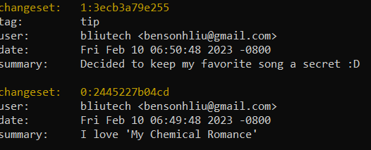
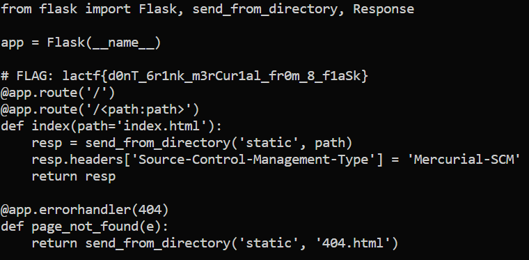

# my-chemical-romance
> When I was... a young boy... I made a "My Chemical Romance" fanpage!

## About the Challenge
We have been given a website about My Chemical Romance

## How to Solve?
First if we check the response header, there is an interesting header:
```
Source-Control-Management-Type: Mercurial-SCM
```
And i think, this is source code exposure in `.hg` directory (You can check the reference [here](https://github.com/daffainfo/AllAboutBugBounty/blob/master/Exposed%20Source%20Code.md))

We need to dump it using this [tool](https://github.com/arthaud/hg-dumper), but the tool is broken and i still can get the sensitive file like `.hg/branch` or `.hg/requires`. And after I dump some file, I am using the `hg` command in Kali. First, I check using the `hg log` command and the result will be like this.



And then i run `hg up 2445227b04cd`. `hg up` is short for `hg update` and it is used to switch to a different version of a repository. In this case i update the repository to version `2445227b04cd`

And then there is a file named `gerard_way2021.py` and if we open the flag we can get the flag


```
lactf{d0nT_6r1nk_m3rCur1al_fr0m_8_f1aSk}
```