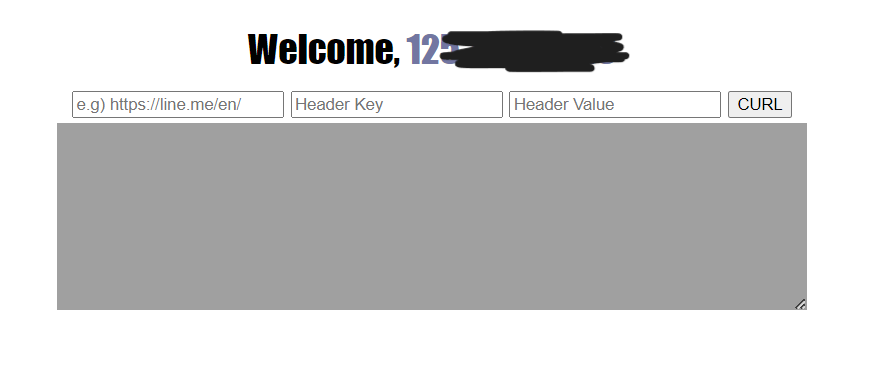
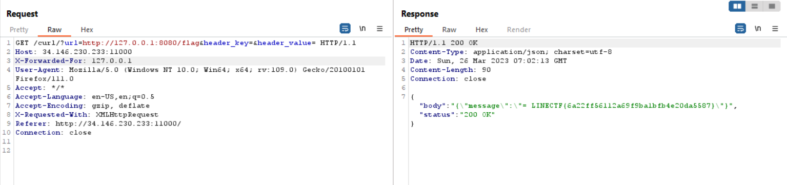

# Baby Simple GoCurl
> Read the flag (/flag)

## About the Challenge
We have been given a source code (You can download the file [here](baby-simple-gocurl_3e562770d3be9c9d047169c7b235281b.tar.gz)) also we need to access `/flag` to get the flag



## How to Solve?
If we check the `main.go` file, we will see there are 3 endpoints that we can access
* `/flag`
* `/curl`
* `/`

To obtain the flag, we must access the `/flag` endpoint. However, the code will first check the IP address, and if it is `127.0.0.1`, we will receive the flag.

```go
r.GET("/flag/", func(c *gin.Context) {
    reqIP := strings.Split(c.Request.RemoteAddr, ":")[0]

    log.Println("[+] IP : " + reqIP)
    if reqIP == "127.0.0.1" {
        c.JSON(http.StatusOK, gin.H{
            "message": flag,
        })
        return
    }

    c.JSON(http.StatusBadRequest, gin.H{
        "message": "You are a Guest, This is only for Host",
    })
})
```

So I tried to put `http://127.0.0.1:8080/flag` in the host, but as we can see the output is `Something Wrong`


That happen because our IP is not `127.0.0.1`. If we check the source code again, this code using `c.ClientIP()`

```go
if c.ClientIP() != "127.0.0.1" && (strings.Contains(reqUrl, "flag") || strings.Contains(reqUrl, "curl") || strings.Contains(reqUrl, "%")) {
    c.JSON(http.StatusBadRequest, gin.H{"message": "Something wrong"})
    return
}
```

And if we check the documentation about `ClientIP()` (You can read about the function [here](https://pkg.go.dev/github.com/gin-gonic/gin#Context.ClientIP))

```
ClientIP implements one best effort algorithm to return the real client IP. It calls c.RemoteIP() under the hood, to check if the remote IP is a trusted proxy or not. If it is it will then try to parse the headers defined in Engine.RemoteIPHeaders (defaulting to [X-Forwarded-For, X-Real-Ip]). If the headers are not syntactically valid OR the remote IP does not correspond to a trusted proxy, the remote IP (coming from Request.RemoteAddr) is returned.
```

We can change the IP address by using `X-Forwarded-For` header or `X-Real-Ip` header. So the final payload will be like this



```
LINECTF{6a22ff56112a69f9ba1bfb4e20da5587}
```