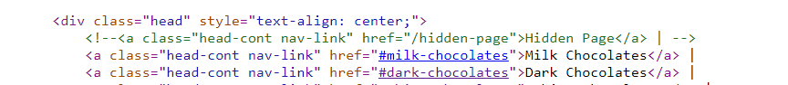

# Feb. 2 - Chocolates
> The first thing I want to give everyone is chocolate, of course. I found this wonderful company that sells the most exquisite chocolates, but I heard that they sell a super special secret valentine chocolate that's hidden somewhere on their website. Here's the website, do you think you can find it for me?

## About the Challenge
We have been given a website, and the website will look like this


## How to Solve?
First i check the source code and then open the `css` file and found some comment like this


And then i tried to put the parameter key in the url. So the url will be look like [this](https://chocolates-mhsctf.0xmmalik.repl.co/?key=thedarkestchocolate) and then in the source code there is a hidden endpoint



When i open the `hidden-page` endpoint, that endpoint still need the key


So, I provide the key in the `hidden-page` endpoint. The URL will look like [this](https://chocolates-mhsctf.0xmmalik.repl.co/hidden-page?key=thedarkestchocolate). And then web said we need to access this endpoint as administrator


If we check the request and response header, there is a cookie like this
```
set-cookie: session=eyJhZG1pbiI6ImZhbHNlIiwidmlzaXRfdGltZSI6IjIwMjMtMDItMTQgMjM6MzQ6NDguMDMzNDM0In0.Y-wjhw.6mRh2D6Q8gE3lq3f2mLQ3IHlc7o; HttpOnly; Path=/
```

At first i thought this is JWT token, but one of the team members said this is flask cookie. So we can bruteforce the cookie to get the secret key and then change into an admin

To bruteforce the flask cookie, we can use https://pypi.org/project/flask-unsign/. And after doing some bruteforce. We can get the flag

```
valentine{1ts_jus7_100%_cacao}
```