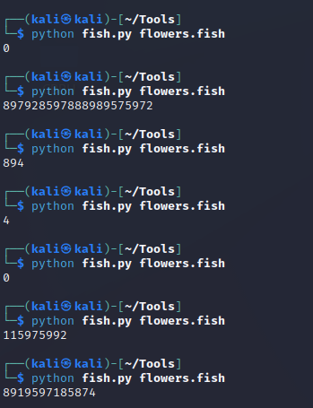

# discord
> Another Valentine classic... flowers! Flowers can be expensive, so I bought a bunch of them cheap online. Turns out they're infested with some kind of bug and I need to buy a specialized pesticide to take care of them. The pesticide is really expensive, but the online seller is willing to give me a discount code if I can analyze a program he gives me. As I said, I'm nine years old sooooooooooo... do it for me? Enter your answers at the given link.

## About the Challenge
We have been given a website to submit the number and some weird file named `flowers.fish.txt` and need to find the flag on it.

## How to Solve?
If we open the file, the file will be looks like this


And then one of the team member said this chall using [esolangs](https://esolangs.org/) website. Because the file named `flowers.fish.txt`, I suspect that this code uses the [Fish](https://esolangs.org/wiki/Fish) language. And then i tried to run the program using "official" interpreter and then I got some number



I created some python code to run the program 1000 times and then get the average number of times the program will produce outputs. The code will be looks like this
```python
import subprocess

def count_digits(numbers):
    count = {}
    for number in numbers:
        for digit in str(number):
            if digit in count:
                count[digit] += 1
            else:
                count[digit] = 1
    return count

results = []
for i in range(1000):
    output = subprocess.run(["python3", "fish.py", "flowers.fish"], capture_output=True, text=True)
    results.append(output.stdout)

print(dict(sorted(count_digits(results).items())))
```
After obtaining output from the program I wrote earlier, I will input it into the submission portal and then I receive the flag
```
valentine{fly1n9_purp13_p3t4l_e4ter5}
```