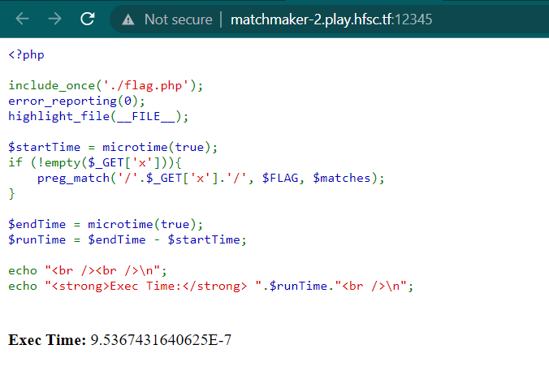
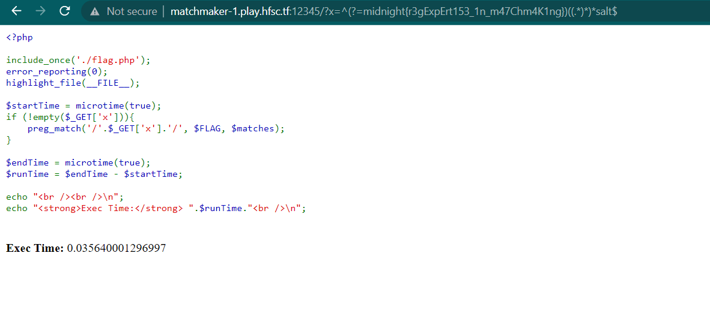

# matchmaker
> Match making as a service.

## About the Challenge
We have been given a website and inide the website there is source code. Here is the preview



And here is the code

```php
<?php

include_once('./flag.php');
error_reporting(0);
highlight_file(__FILE__);

$startTime = microtime(true);
if (!empty($_GET['x'])){
    preg_match('/'.$_GET['x'].'/', $FLAG, $matches);
}

$endTime = microtime(true);
$runTime = $endTime - $startTime;

echo "<br /><br />\n";
echo "<strong>Exec Time:</strong> ".$runTime."<br />\n";
```

The code then checks if the `$_GET['x']` parameter is set and if so, it uses it as a regular expression pattern to search for a match within the `$FLAG` variable that holds the flag. The resulting matches are then stored in the $matches array.

Finally, the code calculates the execution time of the script by measuring the difference between the current time `microtime(true)` before and after the regular expression matching process, and stores it in the `$runTime` variable. The execution time is then outputted along with a label.

This code is vulnerable to ReDoS because we can set a custom regex pattern to find the flag. The execution time becomes slower if the pattern contains wrong characters, but if the pattern is correct, the execution time will be very fast.

## How to Solve?
To solve this, im using [porwsigger blog](https://portswigger.net/daily-swig/blind-regex-injection-theoretical-exploit-offers-new-way-to-force-web-apps-to-spill-secrets) as a reference about ReDoS to spill the secret. So here is the regex that I used to solve the chall

```
^(?=midnight{a)((.*)*)*salt$
```

So you need to brute each character (a-zA-Z0-9) and then check the `Exec Time output`. For example i tried to brute the character after `{`, in this case i will be comparing the 2 characters


As you can see the execution time was `5.9604...E-6`. And then I changed the `a` character to `r`


As you can see the execution time was `0.00478...`. So we know the character after `{` is `r`. Repeat the step to obtain the flag



```
midnight{r3gExpErt153_1n_m47chm4K1ng}
```