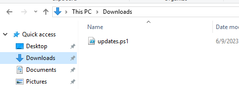

# IR #2
> Can you figure out how the malware got onto the system?

## About the Challenge
We have to find out how the malware can be downloaded

## How to Solve?
As you can see on the VM, the malware was located in `Downloads` folder



So I tried to check the browser download history and I got nothing, and then I tried to open the mail server on the VM, and I got 4 weird emails. 2 of them contain the flag


```
HackTM{Timisoara}
```