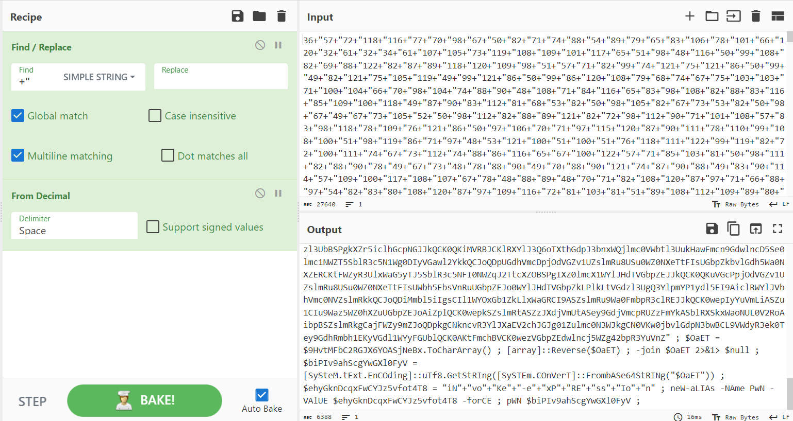

# IR #3
> Can you reverse the malware?

## About the Challenge
We need to reverse engineering the powershell script a.k.a the malware

## How to Solve?
If you open the script using notepad, the malware only contains special character


And then i tried to do some research about obfuscated powershell and I found this [article](https://perl-users.jp/articles/advent-calendar/2010/sym/11) talking about obfuscation on powershell. And as you can see in the article there is a function to obfuscate the powershell

```powershell
function Get-EncodedCode
{
    param([string]$code)
    ([char[]]$code|
    %{
        '${"}'+ ([int]$_  -replace "0",'${=}' -replace "1",'${+}' -replace "2",'${@}' -replace "3",'${.}' -replace "4",'${[}' -replace "5",'${]}' -replace "6",'${(}' -replace "7",'${)}' -replace "8",'${&}' -replace "9",'${|}')
    })  -join '+'
}
```

After that, I tried to create another function to decode the malware (With ChatGPT of course haha), and here is the function to decode the obfuscated powershell

```powershell
function Get-DecodedCode
{
    param([string]$encodedCode)

    # Define the mapping dictionary
    $decodeMap = @{
        '${"}' = '"';
        '${=}' = '0';
        '${+}' = '1';
        '${@}' = '2';
        '${.}' = '3';
        '${[}' = '4';
        '${]}' = '5';
        '${(}' = '6';
        '${)}' = '7';
        '${&}' = '8';
        '${|}' = '9'
    }

    # Replace the encoded characters with their decoded values
    $decodedCode = $encodedCode
    foreach ($key in $decodeMap.Keys) {
        $decodedCode = $decodedCode -replace [regex]::Escape($key), $decodeMap[$key]
    }

    return $decodedCode
}
```

And then I ran another command to read the content of `updates.ps1` and then deobfuscate the malware

```powershell
$encodedCode = Get-Content -Raw -Path "updates.ps1"
$decodedCode = Get-DecodedCode -encodedCode $encodedCode
Write-Host $decodedCode
```

And you will something like this in the terminal


Take the result and then open cyberchef and convert the result using decimal and you will something like this



Take the long string, and then reverse and decode it using `base64`. And voilà, the flag was located inside `$flag` variable


```
flag{892a8921517dcecf90685d478aedf5e2}
```