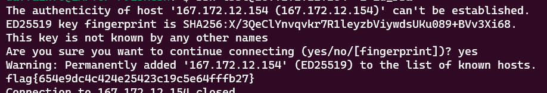

# Raided
> The police raided a server belonging to a very 1337 hax0r that was used to stage attacks. Upon further investigation, this server turned out to be a jump server for the attacker to access more infrastructure.

> A memory snapshot was taken of the machine. See if you can figure out what the attacker was doing and what other systems the hacker was accessing.

## About the Challenge
We've got a memory dump file, and if we check on the description of the chall. Looks like we need to find the attacker server

## How to Solve?
In this case, im only using `strings` and `grep`, First we need to find the attacker server by using this command

```shell
strings raided-challenge-dump-vmem | grep "ssh "
```


The IP address of attacker server was `167.172.12.154` and the username was `l33t`. Now we need to find the private key using this command

```shell
cat raided-challenge-dump-vmem\ \(1\) | grep -Ei "BEGIN OPENSSH PRIVATE KEY-----" -a -A 7
```

This command will find a `BEGIN OPENSSH PRIVATE KEY-----` and then it will print 7 line after matched word


Use that privkey and login to the server by using this command

```shell
ssh l33t@167.172.12.154 -i id_rsa
```



```
flag{654e9dc4c424e25423c19c5e64fffb27}
```