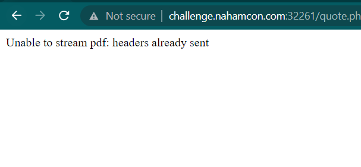

# Stickers
> Wooohoo!!! Stickers!!! Hackers love STICKERS!! You can make your own with our new website!

> Find the flag file in /flag.txt at the root of the filesystem.

## About the Challenge
We got a server that has a functionality to convert our input into a PDF file


## How to Solve?
At first, I thought this website was vulnerable to SSRF where we can input `<iframe src="http://127.0.0.1">` in the `organization` or `email` parameter but I was wrong

And I accidentally made the website error



I researched about this error message, and it appears that this website uses `DOMPDF` to convert our input into a PDF file. Because this website utilizes `DOMPDF`, it reminded me of a machine on HTB where the user had to exploit `RCE` on `DOMPDF`.

Im using this [tool](https://github.com/rvizx/CVE-2022-28368) to easier my work and here is the command I used to exploit the website

```shell
python3 dompdf-rce.py --inject "http://challenge.nahamcon.com:32261/quote.php?email=test%40mail.com&small=3&medium=3&large=3&organisation=" --dompdf "http://challenge.nahamcon.com:32261/dompdf/"
```

And heck yeah, we got a reverse shell. And then read `/flag.txt` to obtain the flag


```
flag{a4d52beabcfdeb6ba79fc08709bb5508}
```