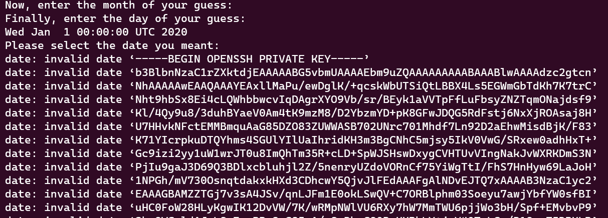
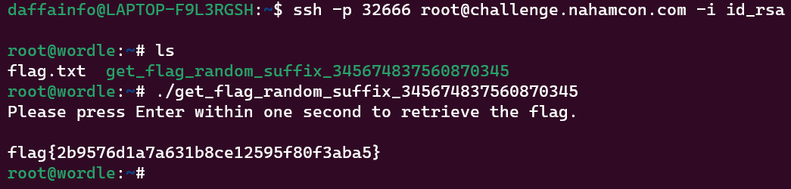

# Wordle Bash
> We put a new novel spin on the old classic game of Wordle! Now it's written in bash! :D

> Oh, and you aren't guessing words, this time...

## About the Challenge
We have been given a SSH server to connect, and after connect we got a bash file called `wordle_bash.sh`. Here is the content of the file

```shell
#!/bin/bash

YEARS=("2020" "2021" "2022" "2023" "2024" "2025")
MONTHS=("01" "02" "03" "04" "05" "06" "07" "08" "09" "10" "11" "12" )
DAYS=("01" "02" "03" "04" "05" "06" "07" "08" "09" "10" "11" "12" "13" "14" "15" "16" "17" "18" "19" "20" "21" "22" "23" "24" "25" "26" "27" "28" "29" "30" "31")

YEARS_SIZE=${#YEARS[@]}
YEARS_INDEX=$(($RANDOM % $YEARS_SIZE))
YEAR=${YEARS[$YEARS_INDEX]}

MONTHS_SIZE=${#MONTHS[@]}
MONTHS_INDEX=$(($RANDOM % $MONTHS_SIZE))
MONTH=${MONTHS[$MONTHS_INDEX]}

DAYS_SIZE=${#DAYS[@]}
DAYS_INDEX=$(($RANDOM % $DAYS_SIZE))
DAY=${DAYS[$DAYS_INDEX]}

TARGET_DATE="${YEAR}-${MONTH}-${DAY}"

gum style \
  --foreground 212 --border-foreground 212 --border double \
  --align center --width 50 --margin "1 2" --padding "2 4" \
  'WORDLE DATE' 'Uncover the correct date!'

echo "We've selected a random date, and it's up to you to guess it!"

wordle_attempts=1
while [ $wordle_attempts -le 5 ]
do
  echo "Attempt $wordle_attempts:"
  echo "Please select the year you think we've chosen:"
  chosen_year=$(gum choose ${YEARS[@]})

  echo "Now, enter the month of your guess: "
  chosen_month=$(gum choose ${MONTHS[@]})

  echo "Finally, enter the day of your guess: "
  chosen_day=$(gum choose ${DAYS[@]})

  guess_date="$chosen_year-$chosen_month-$chosen_day"

  if ! date -d $guess_date; then
    echo "Invalid date! Your guess must be a valid date in the format YYYY-MM-DD."
    exit
  fi

  confirmed=1
  while [ $confirmed -ne 0 ]
  do
    gum confirm "You've entered '$guess_date'. Is that right?"
    confirmed=$?
    if [[ $confirmed -eq 0 ]]
    then
      break
    fi
    echo "Please select the date you meant:"
    guess_date=$(gum input --placeholder $guess_date)
  done

  if [[ $(date $guess_date) == $(date -d $TARGET_DATE +%Y-%m-%d) ]]; then
    gum style \
      --foreground 212 --border-foreground 212 --border double \
      --align center --width 50 --margin "1 2" --padding "2 4" \
      "Congratulations, you've won! You correctly guessed the date!" 'Your flag is:' $(cat /root/flag.txt)
    exit 0
  else
    echo "Sorry, that wasn't correct!"
    echo "====================================="
  fi

  wordle_attempts=$((wordle_attempts+1))
done

gum style \
  --foreground 212 --border-foreground 212 --border double \
  --align center --width 50 --margin "1 2" --padding "2 4" \
  "Sorry, you lost." "The correct date was $TARGET_DATE."
```

This program can also be run as a root user.


## How to Solve?
We can read any file as root because on this line

```shell
...
    guess_date=$(gum input --placeholder $guess_date)
  done

  if [[ $(date $guess_date) == $(date -d $TARGET_DATE +%Y-%m-%d) ]]; then
    gum style \
...
```

If we input `-f /etc/shadow` in the date prompt, it will execute `date -f /etc/shadow` command as root


But when I want to read `/root/flag.txt` file, the result was:


Hmm, that means we need to login as root in order to read the flag. At first I thought I need to bruteforce the `/etc/shadow` root password. But there is another way by reading the content of `/root/.ssh/id_rsa`



Use that key to login as root, and then run the executable program to obtain the flag



```
flag{2b9576d1a7a631b8ce12595f80f3aba5}
```