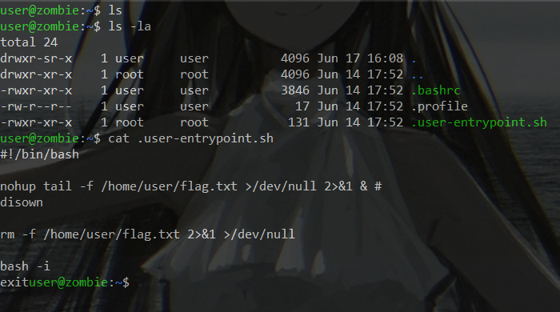
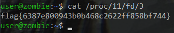

# Zombie
> Oh, shoot, I could have sworn there was a flag here. Maybe it's still alive out there?

## About the Challenge

We given some machine and find the flag

## How to Solve

First we gonna look up the directory with `ls -la`

And you will find some interesting script



From that script, we analyzed the flag is already deleted, but we can use `ps aux` to see the process of script


After that we can see the process in `/proc/` directory


Last we just can cat the flag with `cat /proc/PID/fd/numbers`



```
flag{6387e800943b0b468c2622ff858bf744}
```