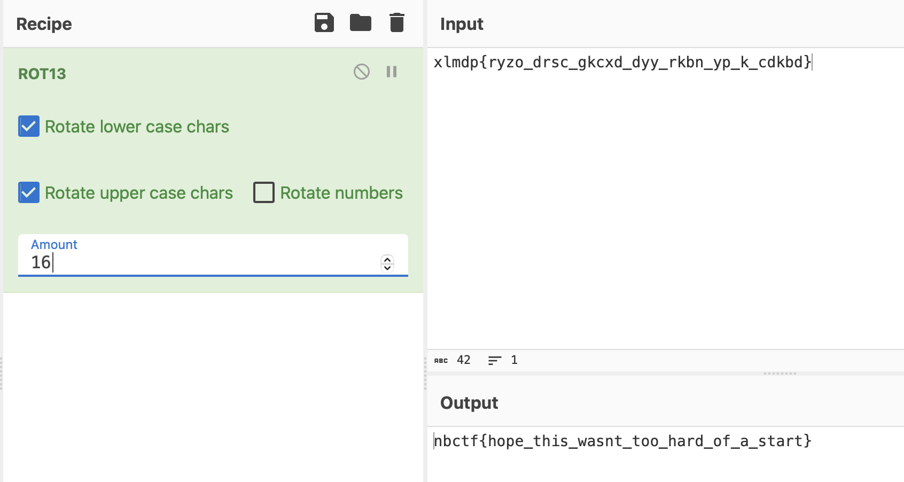

# Caesar Salads
> Every CTF needs an introductory crypto. I found a roman emperor that made this super cool cipher. Can you decrypt this for me?

## About the Challenge
We were given a file called `output.txt` and here is the content of the file

```
Ciphertext: xlmdp{ryzo_drsc_gkcxd_dyy_rkbn_yp_k_cdkbd}
```

## How to Solve?
Replaces each letter with the 16th letter after it in the latin alphabet



```
nbctf{hope_this_wasnt_too_hard_of_a_start}
```