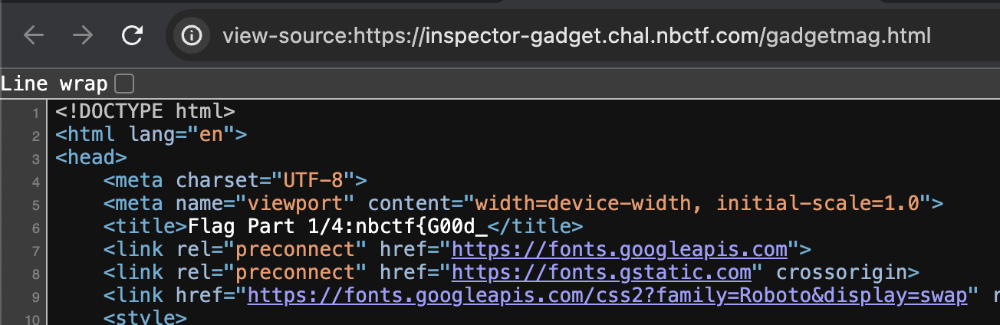
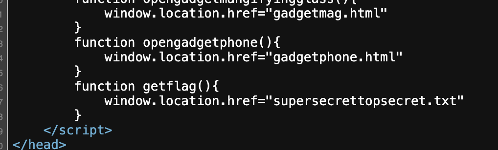
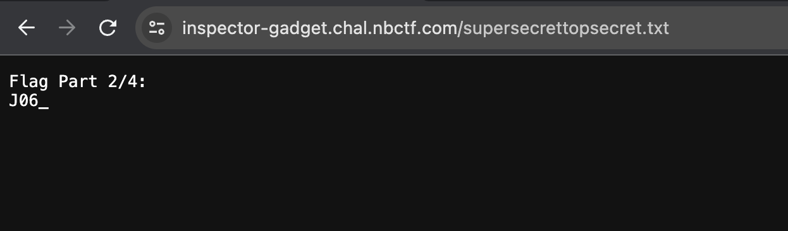
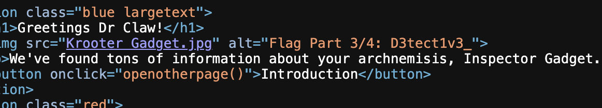
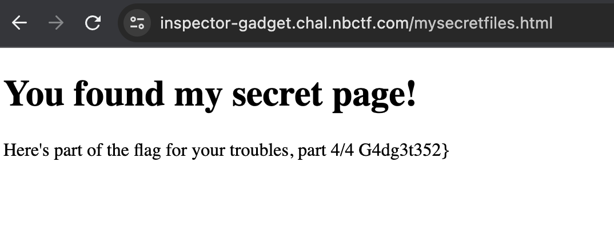

# Inspector Gadget
> While snooping around this website, inspector gadet lost parts of his flag. Can you help him find it?

## About the Challenge
We were given a website without any source code, and the flag has been split into 4 parts. We need to find all of them

## How to Solve?
* Part 1/4:

We can find this in one of the hyperlink (/gadgetmag.html)



* Part 2/4:

There's a hidden file called `supersecrettopsecret.txt` inside `getFlag()` function




* Part 3/4:

We can find this in the homepage



* Part 4/4:

There's a new file called `/mysecretfiles.html` inside `robots.txt`



```
nbctf{G00d_J06_D3tect1v3_G4dg3t352}
```