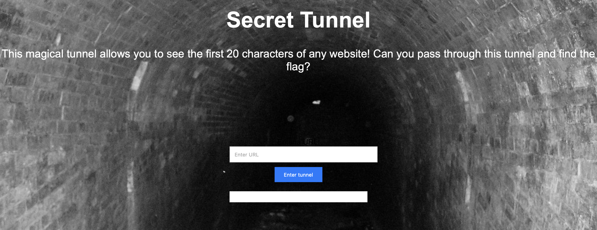
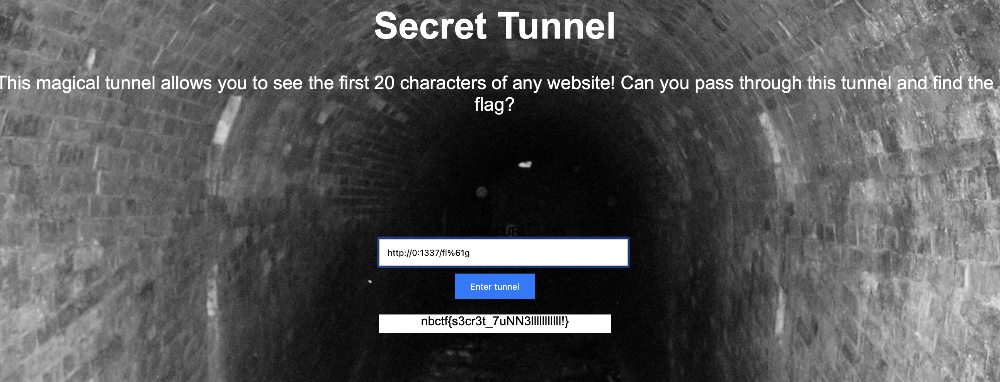

# secret tunnel
> Can you find the flag on the other end of my secret tunnel?

## About the Challenge
We were given a website and source code (You can download the source code [here](secret_tunnel.zip)). Here is the preview of the website



If we check the source code, there are 2 ports `1337` and `80`. To get the flag we need to access port 1337 so this is a SSRF chall. But there are some restrictions:
* Checks if the string "127" is present in the URL.
* Checks if the count of dots in the URL is greater than 2.
* Checks if the character "x" is present in the URL.
* Checks if the string "flag" is present in the URL.

The source code:
```python
@app.route("/fetchdata", methods=["POST"])
def fetchdata():
    url = request.form["url"]

    if "127" in url:
        return Response("No loopback for you!", mimetype="text/plain")
    if url.count('.') > 2:
        return Response("Only 2 dots allowed!", mimetype="text/plain")
    if "x" in url:
        return Response("I don't like twitter >:(" , mimetype="text/plain") 
    if "flag" in url:
        return Response("It's not gonna be that easy :)", mimetype="text/plain")
...
```

## How to Solve?
We can bypass the restriction using `http://0:1337/fl%61g` payload:
* Instead of using localhost / 127.0.0.1 we can bypass it by using `http://0`
* To bypass the `flag` string restriction, we need to encode one / more character using url encoding



```
nbctf{s3cr3t_7uNN3lllllllllll!}
```